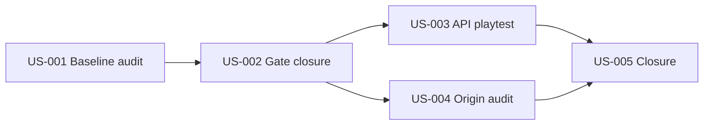

# PRD: 幼年开局体验验收（Stage-2 · 治理与实机）

## 1. Introduction

2026-06-17 API 浏览器实机显示：0～5 岁区间**技术可推进**，但主观耐玩度约 ★★☆☆☆。Stage-1 已在机制层落地分龄 agency；**本 PRD（Stage-2）** 负责门禁回归、3～4 岁实机验收、四出身基线审计与收口报告。

**套件索引：** `docs/PRD/early-childhood-opening-experience-index.md`（含 Stage-1～4 全路线图）

| 阶段 | PRD | 状态 |
| --- | --- | --- |
| **Stage-1** | `early-childhood-agency-mechanics.md` | 已实施 |
| **Stage-2** | **本文件** | 待实施 |
| **Stage-3** | `early-childhood-origin-infant-quest-chains.md` | 待实施（可与 Stage-2 并行） |
| **Stage-4** | `early-childhood-preschool-content-and-pacing.md` | 待实施（可与 Stage-2/3 并行） |

**真源文档：**

- 体验问题：`docs/test-reports/api-browser-playtest-experience-2026-06-17.md`
- 设计规则：`docs/designs/p16-stage-agency-rules.md`
- 体验方案：`docs/designs/early-childhood-agency-and-opening-experience-optimization.md`
- Stage-1 实施记录：`docs/designs/early-childhood-agency-implementation-pack.md`
- P16 背景：`docs/PRD/p16-wuxia-origin-driven-growth-and-composite-destiny.md`

## 2. Goals

- 确认 Stage-1 机制在自动化门禁与 API 浏览器实机中**可验证、可回归**
- 证明 0～4 岁无日常规划三选一，4 岁「童年偏好」仍是第一个正式剧情抉择
- 量化四出身在 0～7 岁的叙事差异，为 Stage-3/4 提供基线数据（**不阻塞**其并行开工）
- 保持 `gate:p16`、`gate:playability` 及 P9 警告基线不退化（或合理文档化调整）
- 产出可交接的体验验收报告，供策划微调与后续 PRD 审批

## 3. 目标体验（冻结决策）

以下决策在本 PRD 范围内**不得重议**：

| 年龄段 | Agency | 界面形态 |
| --- | --- | --- |
| 0～2 岁 | 纯被动 | 仅「继续」/自动剧情；`planningOptions.length === 0` |
| 3～4 岁 | 被动为主 + 稀抉择 | 无日常规划；4 岁 spine「童年偏好」为首个正式抉择 |
| 5～7 岁 | 有限主动 | 最多 2 项 lite 行动（`DAILY_PLANNING_MIN_AGE = 5`） |
| 8～12 岁 | 受限主动 | 遵循 P16 allowlist |

**数值：** 0～2 岁禁止侠义/内功/功力因玩家操作跳变；被动结算仅允许体魄/健康/悟性且单期 Δ≤1。

**内容：** 0～7 岁不强行塞入成人江湖任务；武侠感通过家庭/地域/异象伏笔建立。

## 4. User Stories

### US-001: Stage-1 Baseline Confirmation Audit
**Description:** As a maintainer, I want a read-only confirmation that Stage-1 agency mechanisms are wired as designed so that Stage-2 validation targets the right surfaces.

**Acceptance Criteria:**
- [ ] Confirm `shouldOfferDailyPlanning(age)` returns false for ages 0–4 and true from age 5 (within childhood band rules)
- [ ] Confirm `SessionPhase` includes `passive_progression` and `period_summary` with `passive_continue` / `period_summary` ack kinds
- [ ] Confirm `ageActionStatCaps` clamps chivalry/internalSkill/martialPower at infant band
- [ ] Record findings in `docs/test-reports/early-childhood-stage1-baseline-confirmation.md` (create if missing)
- [ ] Do not modify gameplay behavior in this story

### US-002: Regression Gate Closure After Passive Childhood
**Description:** As a maintainer, I want all childhood-agency regression gates green after Stage-1 so that passive opening does not break CI or playability baselines.

**Acceptance Criteria:**
- [ ] `npm run gate:p16` exits with decision pass
- [ ] `npm exec tsx tests/headless/p72SessionPhase.test.ts` prints ok (infant `passive_progression` case included)
- [ ] `npm run test -- p16OriginDestiny` completes without failure (including chained `p9PlayabilityTests`)
- [ ] `npm run gate:playability` reports 0 blockers
- [ ] If P9 near-duplicate warnings exceed baseline: root cause documented; fix behavior first; baseline update only with written justification in test report
- [ ] Update `docs/test-reports/p8-playability-gate-latest.md` Early narrative samples reflect 0–4 passive (not 0-year three-action planning)
- [ ] Typecheck passes

### US-003: Preschool Agency API Browser Playtest
**Description:** As a player experience reviewer, I want 3–4 year old play to feel passive with only spine choices so that early life matches age expectations.

**Acceptance Criteria:**
- [ ] API mode + browser: 书香门第开局，推进至 ≥4 岁并完成「童年偏好」抉择
- [ ] Ages 3–4: `planningOptions.length === 0` for all observed periods (no 听先生讲课/玩耍练功/与玩伴三行动)
- [ ] Age 4: at least one formal `story_event` choice (童年偏好) with 2–3 options
- [ ] Before every「继续」click: main narrative or `periodSummary` card is non-empty
- [ ] Within 35 steps: placeholder「本期暂无强求的江湖变故…」appears ≤3 times; ages 0–4 show 0 occurrences
- [ ] No chivalry/internalSkill absurd jumps after first passive segment at age 0
- [ ] Save report under `docs/test-reports/api-browser-playtest-stage2.md`
- [ ] Verify in browser using dev-browser skill or documented manual script equivalent

### US-004: Four-Origin Early Childhood Divergence Audit
**Description:** As a designer, I want measurable origin divergence in ages 0–7 so that replay value is observable before investing in full quest chains.

**Acceptance Criteria:**
- [ ] Run four origins (书香门第 / 武林世家 / 商贾之家 / 边疆异族) each to age 7 in API or headless mode
- [ ] Record narrative/passive event id lists per origin
- [ ] Pairwise compare all C(4,2)=6 origin pairs: narrative id overlap <50% for each pair
- [ ] Ages 0–2: 10 periods each origin — 0 planning three-choices; no chivalry/internalSkill absurd jumps
- [ ] Save audit under `docs/test-reports/early-childhood-origin-divergence-stage2.md`
- [ ] If any pair overlap ≥50%: report notes expected improvement from Stage-3/4 PRDs; this story does not implement content fixes
- [ ] Do not modify gameplay behavior in this story

### US-005: Stage-2 Experience Governance Closure
**Description:** As a product owner, I want a single closure summary tying gates and playtests together so that the team can decide whether to open Stage-3.

**Acceptance Criteria:**
- [ ] Create `docs/test-reports/early-childhood-opening-experience-stage2-closure.md`
- [ ] Closure doc references US-002 through US-004 evidence paths
- [ ] Notes baseline metrics for Stage-3/4 sub-agents (overlap %, placeholder counts, playtest rating)
- [ ] Lists residual risks (e.g. passive repetition, spine density, 5–7 lite planning monotony)
- [ ] No code changes in this story

## 5. Functional Requirements

- **FR-1:** Ages 0–4 must not enter `active_planning` with non-empty `planningOptions` under normal progression.
- **FR-2:** `passive_progression` must present `passiveNarrative` before ack; ack `passive_continue` advances time and produces `periodSummary`.
- **FR-3:** `period_summary` phase must show headline, body, and stat delta summary before next ack.
- **FR-4:** Age-band stat clamps must apply to both passive narratives and active actions (if any leak into infant band).
- **FR-5:** Planning placeholder text for ages 0–2 must not use「本期暂无强求的江湖变故，你可安排日常行动」.
- **FR-6:** Spine events at age 4 (`childhood_preference`) must remain reachable and present as `story_event` choices, not replaced by daily planning.
- **FR-7:** Origin-tagged passive selection must prefer origin-matching entries when `eventHistory` has not consumed them.
- **FR-8:** All Stage-2 validation artifacts must be saved under `docs/test-reports/` with reproducible commands.

## 6. Non-Goals (Out of Scope)

- 少年/成年/结局线改动
- P20 全生命周期 pacing 重写
- 物理删除本地模式或大规模 API 契约重构
- Stage-3 / Stage-4 实施（见各自 PRD；本子代理仅验收）
- 顶栏角色名、扰动卡抛光（P3 项，另列 backlog）
- 批量新增 0～7 岁江湖冲突事件

## 7. Design Considerations

- **Agency 真源：** `src/p16/childhoodAgency.ts` — `DAILY_PLANNING_MIN_AGE = 5`
- **Phase 真源：** `HeadlessEngineSessionImpl.getSessionPhase()` — infant/preschool → `passive_progression`
- **被动内容：** `src/data/infantPassiveNarratives.ts`（加权随机；Stage-3 可升级为 quest dequeue）
- **策划稿（未接线）：** `docs/designs/childhood-origin-infant-passive-index.md` 及四份 `*-quest-spec.md`
- **UI：** `GameScreen.vue` period summary card；`App.vue` phase-aware placeholder via `resolvePlanningPlaceholderText`

## 8. Technical Considerations

- **API 权威路径：** 验收以 P6B API + 浏览器为主；headless gate 为回归补充
- **测试命令：**
  ```bash
  npm run gate:p16
  npm exec tsx tests/headless/p72SessionPhase.test.ts
  npm run test -- p16OriginDestiny
  npm run gate:playability
  npm run p6b:serve   # 终端 A
  npm run dev         # 终端 B
  ```
- **已知风险：** Stage-1 增加被动期可能导致 P9 near-duplicate warnings 上升；须修根因或文档化 baseline 调整
- **依赖：** P7.2 session progression contract；P16 childhood agency rules

## 9. Success Metrics

| 指标 | 目标 |
| --- | --- |
| 0～2 岁规划三选一出现次数 | 0 / 10 期 |
| 4 岁前「暂无江湖变故」占位 | 0 次 |
| 35 步内占位文案总计 | ≤3 次 |
| 继续前叙事非空率 | ≥95% |
| 四出身两两叙事重合度 | <50%（6 组） |
| `gate:p16` + `gate:playability` | pass，0 blockers |
| Stage-2 实机主观耐玩（评审） | 较 2026-06-17 基线提升至少 1 档（★★☆→★★★） |

## 10. Risks and Rollback

| 风险 | 缓解 |
| --- | --- |
| 为过关盲目抬 P9 baseline | US-002 要求书面原因；优先修被动去重 |
| 实机与 headless 结论不一致 | 以 API 浏览器报告为准 |
| 四链未接线却要求高差异化 | US-004 未达标 → 仅推荐 Stage-3，不在 Stage-2 硬扩写 |
| Stage-1 未合并/未提交 | US-001 先确认 baseline 再跑 gate |

**回滚：** 按 Story 逆序 revert；移除 `passive_progression` 分支可恢复旧 planning 循环（不推荐）。

## 11. Open Questions

| # | 问题 | 建议默认 |
| --- | --- | --- |
| Q1 | Stage-2 未通过是否阻塞 Stage-3/4？ | **不阻塞**；各 Stage 独立 PRD，由子代理分别验证 |
| Q2 | `origin_background`（1 岁四选一）是否保留？ | **保留**；与 4 岁偏好分层 |
| Q3 | 四出身重合度未达标谁负责修？ | **Stage-3**（出身链）+ **Stage-4**（3～7 密度） |
| Q4 | 实机验收由谁签字？ | 体验者 + 一名开发者各一份 report |

## 12. Story Priority and Dependencies



**实施顺序：** US-001 → US-002 → US-003 + US-004（可并行）→ US-005

---

**状态：** 待实施（套件见 `early-childhood-opening-experience-index.md`）
