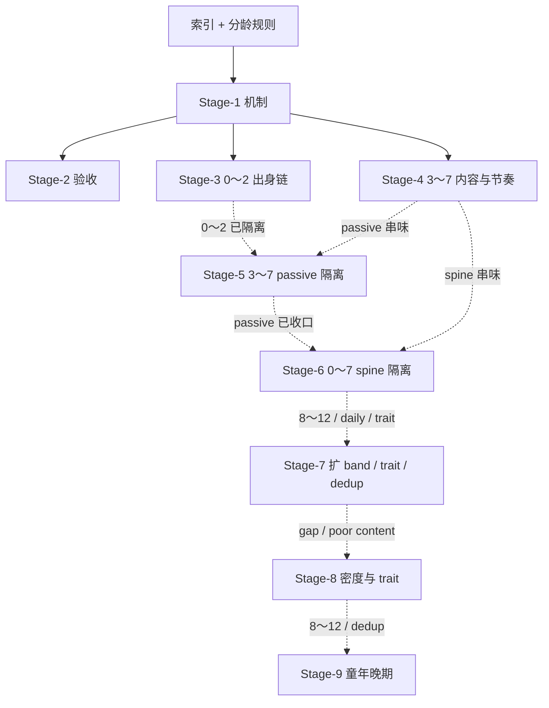

# PRD 索引：幼年开局体验（0～7 岁）

**用途：** 多会话 / 子代理接力时的**总路线图**。各 Stage 独立 PRD、独立验收；**不要求**「上一 Stage 验收通过才能开下一 Stage」——由你在各子代理中自行验证。

**体验真源：** `docs/designs/early-childhood-agency-and-opening-experience-optimization.md`  
**分龄规则：** `docs/designs/p16-stage-agency-rules.md`  
**首测证据：** `docs/test-reports/api-browser-playtest-experience-2026-06-17.md`

---

## 1. 优化模式说明

本项目采用 **「分龄 agency 横切 + 分 Stage 纵向交付」**，不是「一个 Stage 只做一个年龄段」：

| 横切（全 0～7 岁适用） | 各 Stage 分工 |
| --- | --- |
| 0～2 纯被动 | Stage-1 机制 · Stage-3 出身内容 |
| 3～4 被动 + spine 抉择 | Stage-1 机制 · Stage-4 密度与文案 · **Stage-6 spine 隔离** |
| 5～7 有限主动（≤2 lite） | Stage-1 机制 · Stage-4 选项与节奏 · **Stage-6 spine 隔离** |
| 8～12 受限主动 | Stage-7 spine 隔离（gate band）；**Stage-9** agency 形态 + spine 密度 |

---

## 2. PRD 套件

| Stage | PRD 文件 | 焦点 | 依赖建议 | 状态 |
| --- | --- | --- | --- | --- |
| **1** | [`early-childhood-agency-mechanics.md`](./early-childhood-agency-mechanics.md) | Runtime/API：被动 phase、数值 clamp、小结 | 无 | **已实施** |
| **2** | [`early-childhood-opening-experience-governance.md`](./early-childhood-opening-experience-governance.md) | 门禁 + 实机验收 + 四出身基线审计 | 建议 Stage-1 已合入 | **已实施** |
| **3** | [`early-childhood-origin-infant-quest-chains.md`](./early-childhood-origin-infant-quest-chains.md) | 四出身 0～2 岁顺序被动链 | 建议 Stage-1；可与 Stage-2 并行 | **已实施** |
| **4** | [`early-childhood-preschool-content-and-pacing.md`](./early-childhood-preschool-content-and-pacing.md) | 3～7 岁 spine 密度、占位、5～7 轻量选项 | 建议 Stage-1；可与 Stage-3 并行 | **已实施** |
| **5** | [`early-childhood-preschool-origin-isolation.md`](./early-childhood-preschool-origin-isolation.md) | **3～7 岁 passive 出身硬隔离** | Stage-3/4 已合入 | **已实施** |
| **6** | [`early-childhood-spine-origin-isolation.md`](./early-childhood-spine-origin-isolation.md) | **0～7 岁 spine / story_event 出身硬隔离** | Stage-5 已合入；暴露 spine 串味 | **已实施** |
| **7** | [`early-childhood-childhood-experience-stage7.md`](./early-childhood-childhood-experience-stage7.md) | **Spine 扩 band 8～12 · daily gate · trait 线 · neutral 去重** | Stage-6 已合入 | **已实施** |
| **8** | [`early-childhood-passive-density-and-trait-line-stage8.md`](./early-childhood-passive-density-and-trait-line-stage8.md) | **Passive 池加厚 · poor trait spine · gap 收口** | Stage-7 已合入 | **已实施** |
| **9** | [`early-childhood-late-childhood-agency-and-spine-stage9.md`](./early-childhood-late-childhood-agency-and-spine-stage9.md) | **8～12 agency · spine 密度 · neutral spine dedup P2** | Stage-8 已合入 | **已实施** |



**并行建议：** Stage-6 可在 Stage-5 合入后立即开工；主要 touch `GameEngineIntegration.ts`、P22 配置与测试。

**已知问题（Stage-6 目标）：** spine / story_event 跨出身（例：书香 age 2 · `p22_origin_frontier_orphan`）。Stage-5 已消除 passive filler 串味（如 `child_frontier_drill`）。

**设计真源（Stage-6）：** `docs/designs/spine-origin-isolation-rules.md`

---

## 3. 子代理派发模板

```markdown
请阅读 `docs/PRD/early-childhood-opening-experience-index.md`，
仅实施 `docs/PRD/<stage-prd>.md` 中的 **US-00X**（或该 PRD 全部 US）。

约束：
- 遵守各 PRD §3 冻结决策与 §6 非目标
- 验收证据写入 PRD 指定的 `docs/test-reports/` 路径
- 不产出 .prd.json
```

---

## 4. 与 P16 的关系

本套件是 **P16 幼年 agency** 在 **0～7 岁开场 + API 路径** 上的专项落地，不替代 `p16-wuxia-origin-driven-growth-and-composite-destiny.md` 全生命周期目标。

---

## 5. Stage-7 交付记录

| Stage | 焦点 | 状态 |
| --- | --- | --- |
| **7** | Spine gate 扩至 age 12 + daily 回退 gate；trait 线；neutral passive 去重 | **已实施** → [`early-childhood-childhood-experience-stage7.md`](./early-childhood-childhood-experience-stage7.md) |

**Stage-7 设计真源：** `docs/designs/childhood-experience-stage7-rules.md`  
**Closure：** `docs/test-reports/early-childhood-stage7-closure.md`

## 6. 总验收（Stage-1～8）

| 项 | 结果 |
| --- | --- |
| 报告 | [`early-childhood-opening-experience-final-playtest.md`](../test-reports/early-childhood-opening-experience-final-playtest.md) |
| 决策 | **PASS**（2026-06-21 Stage-8 复验） |
| 驱动 | `npm exec tsx scripts/runEarlyChildhoodFinalPlaytest.ts` |
| Stage-8 gap | **2 / 2 / 2 / 0**（≤2 门禁 PASS） |
| Primary flag 补丁 | `EventExecutor` 四主 flag_set 清除冲突项 + `tests/primaryOriginFlagTests.ts`（CI） |
| RNG 确定性 | `HeadlessEngineSessionImpl` passive 选择纳入 seeded RNG（FIX-001） |

## 7. Stage-8 交付记录

| Stage | 焦点 | 状态 |
| --- | --- | --- |
| **8** | Passive 池加厚 + poor trait spine + gap ≤2 + RNG 确定性 | **已实施** → [`early-childhood-passive-density-and-trait-line-stage8.md`](./early-childhood-passive-density-and-trait-line-stage8.md) |

**Stage-8 设计真源：** `docs/designs/childhood-experience-stage8-content-rules.md`  
**Closure：** `docs/test-reports/early-childhood-stage8-closure.md`

## 8. Stage-9 交付记录

| Stage | 焦点 | 状态 |
| --- | --- | --- |
| **9** | 8～12 P16 agency + spine 密度；neutral spine dedup P2；被动同标题连出收口 | **已实施** → [`early-childhood-late-childhood-agency-and-spine-stage9.md`](./early-childhood-late-childhood-agency-and-spine-stage9.md) |

**Stage-9 设计真源：** `docs/designs/p16-stage-agency-rules.md` § Late Childhood (8–12)  
**Closure：** `docs/test-reports/early-childhood-stage9-closure.md`

---

**索引版本：** 0.8 · 2026-06-21
