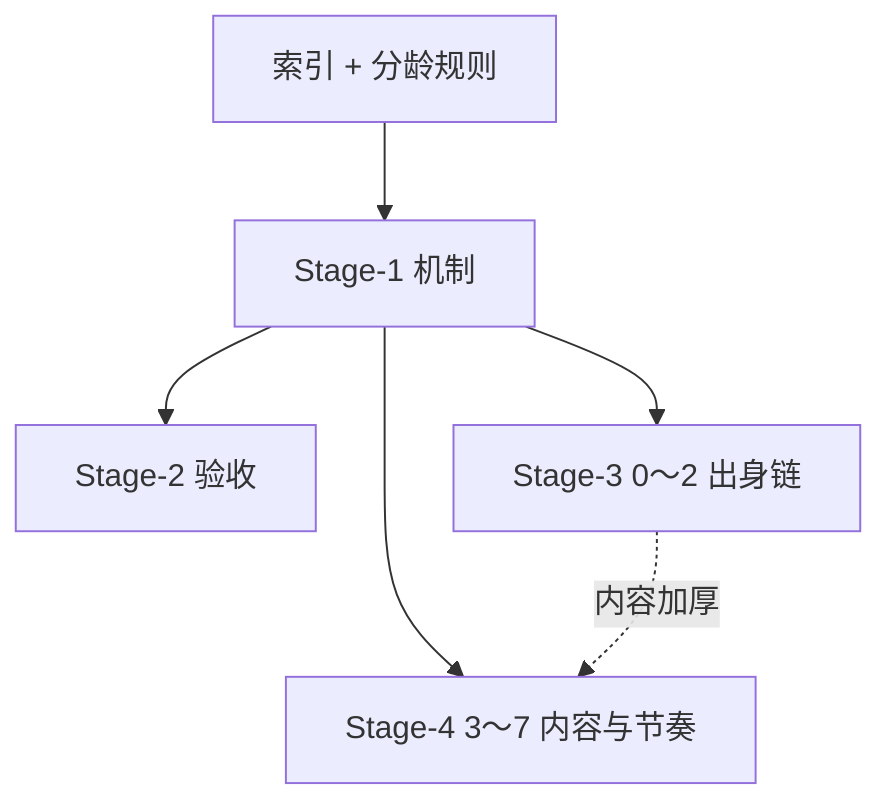

# PRD 索引：幼年开局体验（0～7 岁）

**用途：** 多会话 / 子代理接力时的**总路线图**。各 Stage 独立 PRD、独立验收；**不要求**「上一 Stage 验收通过才能开下一 Stage」——由你在各子代理中自行验证。

**体验真源：** `docs/designs/early-childhood-agency-and-opening-experience-optimization.md`  
**分龄规则：** `docs/designs/p16-stage-agency-rules.md`  
**首测证据：** `docs/test-reports/api-browser-playtest-experience-2026-06-17.md`

---

## 1. 优化模式说明

本项目采用 **「分龄 agency 横切 + 分 Stage 纵向交付」**，不是「一个 Stage 只做一个年龄段」：

| 横切（全 0～7 岁适用） | 各 Stage 分工 |
| --- | --- |
| 0～2 纯被动 | Stage-1 机制 · Stage-3 出身内容 |
| 3～4 被动 + spine 抉择 | Stage-1 机制 · Stage-4 密度与文案 |
| 5～7 有限主动（≤2 lite） | Stage-1 机制 · Stage-4 选项与节奏 |
| 8～12 受限主动 | P16 范围外（本套件不覆盖） |

---

## 2. PRD 套件

| Stage | PRD 文件 | 焦点 | 依赖建议 | 状态 |
| --- | --- | --- | --- | --- |
| **1** | [`early-childhood-agency-mechanics.md`](./early-childhood-agency-mechanics.md) | Runtime/API：被动 phase、数值 clamp、小结 | 无 | 已实施（可作基线参考） |
| **2** | [`early-childhood-opening-experience-governance.md`](./early-childhood-opening-experience-governance.md) | 门禁 + 实机验收 + 四出身基线审计 | 建议 Stage-1 已合入 | 待实施 |
| **3** | [`early-childhood-origin-infant-quest-chains.md`](./early-childhood-origin-infant-quest-chains.md) | 四出身 0～2 岁顺序被动链 | 建议 Stage-1；可与 Stage-2 并行 | 待实施 |
| **4** | [`early-childhood-preschool-content-and-pacing.md`](./early-childhood-preschool-content-and-pacing.md) | 3～7 岁 spine 密度、占位、5～7 轻量选项 | 建议 Stage-1；可与 Stage-3 并行 | 待实施 |



**并行建议：** Stage-2 / 3 / 4 可由不同子代理同时进行；合并前各自跑门禁，冲突集中在 `infantPassiveNarratives`、调度与 UI 文案。

---

## 3. 子代理派发模板

```markdown
请阅读 `docs/PRD/early-childhood-opening-experience-index.md`，
仅实施 `docs/PRD/<stage-prd>.md` 中的 **US-00X**（或该 PRD 全部 US）。

约束：
- 遵守各 PRD §3 冻结决策与 §6 非目标
- 验收证据写入 PRD 指定的 `docs/test-reports/` 路径
- 不产出 .prd.json
```

---

## 4. 与 P16 的关系

本套件是 **P16 幼年 agency** 在 **0～7 岁开场 + API 路径** 上的专项落地，不替代 `p16-wuxia-origin-driven-growth-and-composite-destiny.md` 全生命周期目标。

---

**索引版本：** 0.1 · 2026-06-18
