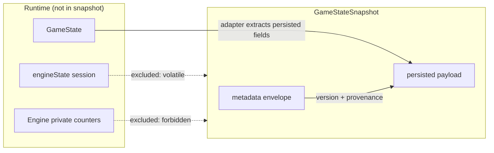

# Game State Snapshot Contract (P4 US-003)

**Story:** P4 US-003 — Define Game State Snapshot Contract

**Authority inputs:** `docs/PRD/p4-engine-contract-and-service-boundary.md`, `docs/p4-non-runtime-behavior-guardrails.md`, `docs/test-reports/p4-engine-boundary-baseline.md`, runtime `GameState` in `src/types/eventTypes.ts`.

**Purpose:** Define a versioned, JSON-serializable `GameStateSnapshot` contract for future persistence, API transport, and backend separation. This document is the single source of truth for snapshot shape and field policy until US-004 adds TypeScript types.

**Non-goals (this story):** Does not replace runtime `GameState`; does not implement persistence, migration, or validators; does not modify gameplay code.

---

## 1. Contract overview

### 1.1 Runtime vs snapshot

| Concept | Role | Location today |
| --- | --- | --- |
| **`GameState`** | Authoritative **runtime** gameplay state; mutated by engine, saved wholesale by `SaveManager` | `src/types/eventTypes.ts`, held in `GameEngineIntegration` (Vue reactive) |
| **`GameStateSnapshot`** | **Transport/persistence contract** — plain JSON object describing durable game progress | Defined here; TypeScript types in US-004 |

A snapshot is a **lossless representation of persisted progress**, not a mirror of everything in memory at save time. Volatile UI session state and engine-private counters are excluded by design.



### 1.2 Serialization requirements

- Must round-trip through `JSON.stringify` / `JSON.parse` without functions, `undefined`, circular references, or Vue reactive proxies.
- All field values must be JSON primitives, arrays, or plain objects.
- Adapters produce snapshots **from** runtime state; consumers hydrate runtime **via** an approved load path (future stories). P4 does not change the current load path.

---

## 2. Versioning model

Three independent version dimensions appear in snapshot metadata. They must not be conflated.

| Field | Constant (documented) | Meaning | Current reference value |
| --- | --- | --- | --- |
| **`schemaVersion`** | `GAME_STATE_SNAPSHOT_SCHEMA_VERSION` | Shape and field policy of **this contract** | `2.0.0` |
| **`engineVersion`** | — | Build of the game engine that produced or last mutated the snapshot | Package/app semver at build time (e.g. `0.0.0` from `package.json`) |
| **`eventCatalogVersion`** | — | Version of the bundled event catalog used for selection/execution | `1.0.0` from `src/data/events.json` `version` |

**Distinction from P2 save schema:** Runtime `GameState.saveVersion` (e.g. `2.0.0-p2`, stamped by `SaveManager`) tracks **legacy client save compatibility**. Snapshot `schemaVersion` tracks the **P4 transport contract**. Both may appear in the same payload during transition; US-017 defines save migration policy.

---

## 3. Envelope structure

Every valid `GameStateSnapshot` is a single object with a required **`metadata`** envelope and a required **`state`** payload.

```json
{
  "metadata": { },
  "state": { }
}
```

### 3.1 Required metadata

| Field | Type | Classification | Description |
| --- | --- | --- | --- |
| `schemaVersion` | `string` (semver) | **persisted (envelope)** | Snapshot contract version; must equal `GAME_STATE_SNAPSHOT_SCHEMA_VERSION` for this spec |
| `engineVersion` | `string` | **persisted (envelope)** | Engine build that wrote the snapshot |
| `eventCatalogVersion` | `string` | **persisted (envelope)** | Event catalog version bound to this life |
| `createdAt` | `number` (Unix ms) | **persisted (envelope)** | First time this logical save/snapshot was created |
| `updatedAt` | `number` (Unix ms) | **persisted (envelope)** | Last time this snapshot was written |
| `sourcePlatform` | `SourcePlatform` | **persisted (envelope)** | Origin platform identifier (see §3.2) |

Optional envelope fields (allowed, not required for minimum valid snapshot):

| Field | Type | Classification | Description |
| --- | --- | --- | --- |
| `snapshotId` | `string` | **persisted (envelope)** | Stable id when stored in a save slot or cloud row |
| `lifeMemorySchemaVersion` | `string` | **derived (hint)** | Expected output version if `deriveLifeMemorySummary` is run; not stored as redundant blob |
| `contentHash` | `string` | **derived (integrity)** | Optional hash of canonical `state` for replay/audit (US-011+) |

### 3.2 Source platform

```typescript
type SourcePlatform =
  | 'web-browser'      // main Vue client, localStorage saves
  | 'node-headless'    // GameProcessSimulator, gate scripts
  | 'export-json'      // SaveManager export/import portable JSON
  | 'api-server'       // reserved: future backend writer
  | 'mini-program';    // reserved: future WeChat mini-program client
```

Platform values are **declarative provenance**, not security boundaries. Future backends must not trust client-supplied engine or catalog versions without verification (US-007+).

---

## 4. Field classification legend

Every field in or related to a snapshot belongs to exactly one primary class:

| Class | Meaning | In `GameStateSnapshot`? | On load |
| --- | --- | --- | --- |
| **persisted** | Authoritative durable progress; required for resume | **Yes** — in `state` or envelope | Must hydrate runtime |
| **derived** | Computable from persisted fields; redundant if stored | **No** — omit from snapshot | Recompute after hydrate |
| **volatile** | Session/UI-only; lost on reload today | **No** | Cleared; recomputed by `getNextEvent` flow |
| **deprecated** | Legacy shape kept for backward compatibility | **Optional** — may appear in imported saves | Normalize on read (future migration) |
| **forbidden** | Must never appear in a valid contract snapshot | **Rejected** if present | N/A |

**Rule:** Validators (US-006) treat unexpected **forbidden** keys as errors and **derived** keys in `state` as warnings unless explicitly allowed for transition.

---

## 5. Payload (`state`) — top-level fields

The `state` object mirrors the **persisted subset** of runtime `GameState`. Field names align with `src/types/eventTypes.ts` unless noted.

| Field | Classification | Required | Notes |
| --- | --- | --- | --- |
| `player` | persisted | **yes** | Full `PlayerState` persisted subset (§6) |
| `currentTime` | persisted | recommended | `{ year, month, day }`; engine calendar |
| `flags` | persisted | **yes** | World/player flag map; route sync signals |
| `relations` | persisted | **yes** | Numeric affinity map by relation id |
| `eventHistory` | persisted | **yes** | Formal trigger log (§9) |
| `routeStates` | persisted | recommended | Structured route lifecycle (§7) |
| `routeHistory` | persisted | recommended | Route transition audit trail (§7) |
| `lifePath` | persisted | recommended | Faction, focus, commitments (§8) |
| `identity` | persisted | optional | Multi-identity record |
| `karma` | persisted | optional | Good/evil karma + history |
| `criticalChoices` | persisted | optional | Key fork records |
| `achievements` | persisted | optional | Top-level achievement ids |
| `inventory` | persisted | optional | Item list |
| `statistics` | derived | **omit** | Recomputable tallies |
| `ending` | persisted | optional | Present when life terminated |
| `saveVersion` | persisted | recommended | P2 save schema marker inside payload |
| `lastSavedAt` | persisted | recommended | Client write timestamp (payload) |
| `gameTimestamp` | persisted | optional | In-game or session timestamp |
| `triggeredEvents` | deprecated | optional | Superseded by `eventHistory`; keep if present in legacy saves |
| `events` | deprecated | optional | Legacy alias of history; prefer `eventHistory` |

---

## 6. Player state (`state.player`)

### 6.1 Persisted player fields

| Field | Classification | Notes |
| --- | --- | --- |
| `name`, `age`, `gender` | persisted | Identity basics |
| Combat/social stats (`martialPower`, `reputation`, `money`, …) | persisted | All numeric progression fields |
| `sect`, `title`, `alive`, `deathReason` | persisted | Status |
| `traitProfile`, `lifeStates`, `talents` | persisted | Trait/talent system |
| `relationships` | persisted | Structured NPC list (§8.1) |
| `spouse`, `children` | persisted | Family summary |
| `timeUnit`, `monthProgress`, `dayProgress` | persisted | Sub-year pacing |
| `growthBiasSummary` | persisted | Narrative bias tags |
| `investments` | persisted | Required canonical lifetime investment directions: `martial`, `statecraft`, `official`, `hermit` |

### 6.2 Deprecated player fields

| Field | Classification | Notes |
| --- | --- | --- |
| `flags` (on player) | deprecated | Duplicate of world flags; normalize to `state.flags` on ingest |
| `events` (on player) | deprecated | Legacy event list; prefer `state.eventHistory` |
| `items` | deprecated | Prefer `state.inventory` |
| `health`, `energy`, `wealth` | deprecated | Optional compat; map to current stat model when migrating |

### 6.3 Forbidden in snapshot

| Field | Classification | Reason |
| --- | --- | --- |
| Vue reactive proxies | forbidden | Strip to plain objects before serialize |
| Functions, class instances | forbidden | Not JSON-safe |

---

## 7. Route state representation

Route progress uses **two persisted layers** plus **derived display**. All structured route data lives on `state`, not in UI.

### 7.1 `state.routeStates` (persisted)

Map keyed by `routeId`. Each entry:

```typescript
{
  routeId: string;
  lifecycle: 'inactive' | 'temporary' | 'active' | 'locked_in' | 'turned' | 'completed' | 'failed';
  category: 'main' | 'secondary';
  lockedIn: boolean;
  lastChangedAtAge?: number;
  sourceEventId?: string;
  reason?: string;
}
```

**Authority:** Written by `RouteStateManager` on flag effects and explicit route transitions. This is the **canonical structured route store** for snapshots.

### 7.2 `state.routeHistory` (persisted)

Ordered append-only log of transitions:

```typescript
{
  routeId: string;
  from: RouteLifecycle;
  to: RouteLifecycle;
  category: 'main' | 'secondary';
  lockedIn: boolean;
  age?: number;
  eventId?: string;
  reason?: string;
  timestamp: number;
}
```

Used for audit, life memory key choices, and replay diagnostics.

### 7.3 Flag-based route signals (persisted)

Route-related **flags** in `state.flags` (e.g. route activation, faction, golden-line markers) remain persisted. They influence selection weights and UI labels alongside `routeStates`.

**Policy:** Snapshots include both `routeStates`/`routeHistory` **and** route-relevant flags. Adapters must not drop flags assuming `routeStates` alone is sufficient.

### 7.4 Derived route presentation (omit from snapshot)

| Output | Source | Classification |
| --- | --- | --- |
| `LifeMemorySummary.routeStatus` | `deriveLifeMemorySummary(state)` | derived |
| Player-facing route labels | `flags` + `routeStates` + label utils | derived |
| `RouteCompatibilityRules` evaluation | Engine at selection time | volatile / runtime |

---

## 8. Relationship representation

Relationships appear in **three persisted shapes**; snapshots include all that exist on the runtime object.

### 8.1 `state.player.relationships` (persisted)

Structured list — primary human-readable relationship store:

```typescript
{
  id: string;
  role: 'master' | 'lover' | 'sworn' | 'rival' | 'friend' | 'family' | 'enemy' | 'patron';
  name: string;
  affinity: number;
  status?: string;
}
```

### 8.2 `state.relations` (persisted)

Numeric affinity map `{ [relationId: string]: number }`. Used by effects and life memory when structured entries are absent. Keys may overlap with `player.relationships[].id`.

**Policy:** Both maps are persisted. Future normalization may merge on read; P4 snapshot contract preserves current runtime shape without loss.

### 8.3 `state.lifePath.relationships` (persisted)

Categorical buckets when `lifePath` is present:

```typescript
{
  allies: string[];
  enemies: string[];
  mentors: string[];
  disciples: string[];
}
```

### 8.4 Family shorthand (persisted)

`player.spouse`, `player.children` — summary fields referenced by life memory and events.

### 8.5 Derived relationship views (omit)

| Output | Classification |
| --- | --- |
| `LifeMemorySummary.relationships` | derived |
| Affinity band labels (`close`, `hostile`, …) | derived |

---

## 9. Event history representation

### 9.1 Canonical log: `state.eventHistory` (persisted)

Array of `EventRecord`:

```typescript
{
  eventId: string;
  age?: number;
  timestamp?: number | { year: number; month: number; day: number };
  triggeredAt?: number | { year: number; month: number; day: number };
  gameTime?: number;
  realTime?: number;
  selectedChoice?: string;
  stateSnapshot?: Partial<GameState>;  // see §9.3
  appliedEffects?: EffectDefinition[];
}
```

**Policy:** `eventHistory` is the **canonical** persisted audit trail for triggered events and choices.

### 9.2 Legacy / auxiliary (deprecated)

| Field | Classification | Notes |
| --- | --- | --- |
| `state.triggeredEvents` | deprecated | Id list only; redundant with history |
| `state.events` | deprecated | Alias; prefer `eventHistory` |
| `player.events` | deprecated | Legacy nested list |

### 9.3 Nested `stateSnapshot` on records

`EventRecord.stateSnapshot` may contain a **partial** `GameState` at event time.

| Classification | Policy |
| --- | --- |
| **persisted** (if present on runtime record) | Include in snapshot as-is when serializing full save |
| **derived-heavy** | Often redundant with top-level `state`; future replay contract (US-011) may trim or hash |
| **forbidden keys inside nested snapshot** | Same forbidden rules as top-level (no proxies, no engine counters) |

For **minimum transport snapshots**, nested `stateSnapshot` on old records may be omitted by an approved adapter when a full top-level `state` is present (optimization — not required in P4).

---

## 10. Life memory — inputs vs derived output

Life memory is **derived-only** at runtime (`src/types/lifeMemory.ts`, `deriveLifeMemorySummary`). It must **not** be stored as a redundant persisted blob inside `GameStateSnapshot.state`.

### 10.1 Persisted inputs (must be present for accurate re-derivation)

| Input field | Used for |
| --- | --- |
| `routeStates`, `routeHistory` | Route status, phase, transitions |
| `flags` | Route flags, debts, risks, achievements |
| `eventHistory` | Key choices, payoff linkage |
| `criticalChoices` | Fork summary |
| `player.relationships`, `relations`, `spouse`, `children` | Relationship panel |
| `lifePath` (faction, commitments, achievements, relationships) | Faction label, debts, allies/enemies |
| `achievements`, `identity.achievements`, `lifePath.achievements` | Achievement entries |
| `player.age` | `derivedAtAge` |
| Player stats (`health`, `constitution`, karma, …) | Risk entries |

### 10.2 Derived output (forbidden in `state`)

| Field | Classification |
| --- | --- |
| `LifeMemorySummary` | derived |
| `serializeLifeMemorySummary(...)` output | derived |

**Optional envelope hint:** `metadata.lifeMemorySchemaVersion` may record which derivation schema consumers should expect (`1.0.0` = `LIFE_MEMORY_SCHEMA_VERSION`). The summary itself is still not persisted in `state`.

### 10.3 Derivation contract reference

After hydrate, `deriveLifeMemorySummary(state)` must produce a summary consistent with P3 life memory behavior. Snapshot contract guarantees **inputs**; US-008 choice response may attach **deltas** separately.

---

## 11. Save metadata representation

Save metadata spans **three layers**. Only layers 1–2 are part of `GameStateSnapshot`; layer 3 is the local storage wrapper.

### 11.1 Snapshot envelope (layer 1 — required)

See §3.1: `schemaVersion`, `engineVersion`, `eventCatalogVersion`, `createdAt`, `updatedAt`, `sourcePlatform`.

This is the **contract-level** provenance block for API and cloud transport.

### 11.2 Payload timestamps (layer 2 — persisted inside `state`)

| Field | Classification | Source today |
| --- | --- | --- |
| `saveVersion` | persisted | `P2_SAVE_SCHEMA_VERSION` via `applyP2SaveVersionMarker` |
| `lastSavedAt` | persisted | Set on save write |
| `gameTimestamp` | persisted | Set on save write |

These remain on the payload for **P2 client save compatibility** until US-017 migration policy subsumes them.

### 11.3 Save slot wrapper (layer 3 — outside snapshot core)

`SaveData` in `SaveManager` wraps `gameData: GameState` with:

| Field | Classification | In `GameStateSnapshot`? |
| --- | --- | --- |
| `id`, `name`, `timestamp` | persisted (storage row) | Optional — map to `metadata.snapshotId` + `updatedAt` when adapting |
| `metadata.playerAge` | derived | **No** — compute from `state.player.age` |
| `metadata.playerName` | derived | **No** — compute from `state.player.name` |
| `metadata.eventCount` | derived | **No** — compute from `state.eventHistory.length` |
| `metadata.playTime` | derived | **No** — heuristic; optional in UI lists only |

**Adapter rule:** Exporting a `GameStateSnapshot` from `SaveData` copies envelope metadata from save row + payload markers; drops derived `SaveMetadata` tallies.

---

## 12. Volatile and forbidden exclusions

### 12.1 Volatile — composable session (`useNewGameEngine.engineState`)

Not part of `GameState` or snapshot. Cleared on load; `getNextEvent()` repopulates.

| Field | Classification |
| --- | --- |
| `currentEvent` | volatile |
| `availableChoices` | volatile |
| `lastEffects` | volatile |
| `lastOutcomeText` | volatile |
| `lastChoiceFeedback` | volatile |
| `isAutoPlaying` | volatile |

**Resume semantics:** A loaded snapshot does not include pending choice UI. Consumer runs selection after hydrate (current main-flow behavior).

### 12.2 Forbidden — engine-private instance state

Not on `GameState`; must never be serialized into a snapshot.

| Field | Location | Classification |
| --- | --- | --- |
| `eventsThisYear` | `GameEngineIntegration` | forbidden |
| `lastYear` | `GameEngineIntegration` | forbidden |
| `annualEventPressure` | `GameEngineIntegration` | forbidden |
| `eventCooldown` | `GameEngineIntegration` | forbidden |
| `activeStoryLines` | `GameEngineIntegration` | forbidden |
| `pendingEventOutcomeNote` | `GameEngineIntegration` | forbidden |
| `suppressLethalSetbacks` | `GameEngineIntegration` | forbidden (eval/sim hook) |

**Note:** `loadGameState` resets yearly counters from hydrated `eventHistory` and player age. Snapshots rely on **persisted history**, not these counters.

### 12.3 Forbidden — transport integrity

| Content | Classification |
| --- | --- |
| Functions, symbols, `undefined` values | forbidden |
| Vue `reactive()` / `ref()` proxies | forbidden |
| DOM nodes, `window`, `localStorage` keys | forbidden |
| Full bundled event catalog JSON | forbidden (use `eventCatalogVersion` reference) |
| `LifeMemorySummary` blob in `state` | forbidden (derived) |

---

## 13. Minimal valid snapshot example (illustrative)

Abbreviated 0–50 midlife sample — no local paths; full fixture in US-005.

```json
{
  "metadata": {
    "schemaVersion": "2.0.0",
    "engineVersion": "0.0.0",
    "eventCatalogVersion": "1.0.0",
    "createdAt": 1717200000000,
    "updatedAt": 1717203600000,
    "sourcePlatform": "web-browser",
    "snapshotId": "save_1717200000000_abc"
  },
  "state": {
    "saveVersion": "2.0.0-p2",
    "lastSavedAt": 1717203600000,
    "player": {
      "name": "沈无名",
      "age": 35,
      "gender": "male",
      "martialPower": 42,
      "reputation": 120,
      "money": 800,
      "alive": true,
      "relationships": [
        { "id": "spouse_1", "role": "lover", "name": "林婉儿", "affinity": 75 }
      ]
    },
    "currentTime": { "year": 35, "month": 6, "day": 1 },
    "flags": { "route_hero_active": true, "married": true },
    "relations": { "spouse_1": 75, "master_wudang": 60 },
    "eventHistory": [
      {
        "eventId": "hero_origin_01",
        "age": 16,
        "selectedChoice": "accept_path"
      }
    ],
    "routeStates": {
      "hero": {
        "routeId": "hero",
        "lifecycle": "active",
        "category": "main",
        "lockedIn": false,
        "lastChangedAtAge": 28
      }
    },
    "routeHistory": [
      {
        "routeId": "hero",
        "from": "inactive",
        "to": "active",
        "category": "main",
        "lockedIn": false,
        "age": 28,
        "timestamp": 1717200000000
      }
    ],
    "lifePath": {
      "primaryIdentity": "hero",
      "faction": "orthodox",
      "lifeStage": "achievement",
      "achievements": [],
      "relationships": { "allies": [], "enemies": [], "mentors": [], "disciples": [] },
      "commitments": { "cannotJoin": [], "mustProtect": [], "swornEnemies": [] },
      "focus": { "martial": 60, "business": 10, "academic": 5, "leadership": 25 }
    },
    "criticalChoices": { "sect_choice": "orthodox" }
  }
}
```

---

## 14. Adapter guidance (informative)

Future adapters (US-004+, persistence stories) should follow:

1. **Extract** plain object from `gameEngine.getGameState()` (strip reactivity).
2. **Build envelope** metadata with current schema, engine, and catalog versions and platform.
3. **Copy** persisted `state` fields per §5–§11; omit derived and volatile.
4. **Reject** forbidden keys if implementing strict validation.
5. **Do not** write `LifeMemorySummary` or UI session fields into the snapshot.
6. On **import**, map envelope + `state` to runtime hydrate; recompute derived views; call selection for pending event.

Mapping from runtime `GameState` → `GameStateSnapshot.state` is **mostly 1:1** on persisted fields today because `SaveManager` already stores full `GameState`. The contract makes implicit policy **explicit** for backend and mini-program work.

---

## 15. Related documents and follow-up stories

| Document / story | Role |
| --- | --- |
| US-004 Add Game State Snapshot Types | TypeScript `GameStateSnapshot` interfaces |
| US-005 Add Snapshot Serialization Fixture | Representative 0–50 JSON fixture |
| US-006 Add Snapshot Contract Tests | Round-trip, metadata, forbidden-field tests |
| US-017 Define Save Schema Versioning Policy | P2 `saveVersion` migration vs `schemaVersion` |
| US-011 Define Replay Log Contract | Choice log + snapshot hash integrity |
| `docs/p4-non-runtime-behavior-guardrails.md` | P4 change prohibitions |
| `src/types/lifeMemory.ts` | Derived life memory output schema |

---

## 16. US-003 acceptance对照

| Acceptance criterion | Section |
| --- | --- |
| Define a versioned `GameStateSnapshot` contract | §1–§3, §13 |
| Classify fields as persisted, derived, volatile, deprecated, or forbidden | §4, §5–§12 |
| Required metadata: schema, engine, catalog versions, created/updated time, source platform | §3.1 |
| Route state, relationships, life memory inputs, event history, save metadata representation | §7–§11 |
| Typecheck passes | Run `npm run typecheck` (docs-only story) |

---

*P4-W1 / US-003 — versioned snapshot contract for transport and persistence without replacing runtime `GameState`.*
