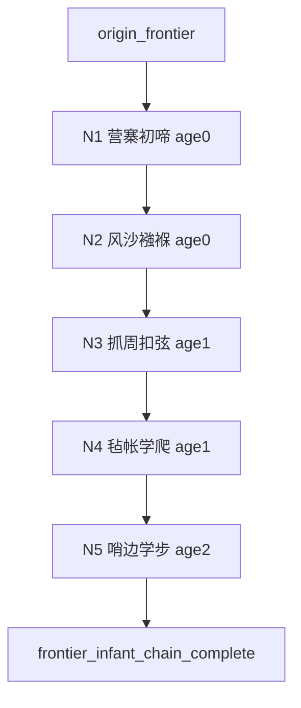

# Quest Spec：边疆异族 · 0～2 岁被动事件链

**Quest ID：** `quest_frontier_infant_passive_0_2`  
**状态：** 待审批（内容策划稿，非实现指令）  
**真源：** `docs/designs/early-childhood-agency-and-opening-experience-optimization.md`（§5、§6）、`docs/designs/p16-stage-agency-rules.md`、`docs/test-reports/api-browser-playtest-experience-2026-06-17.md`  
**范围：** 出身「边疆异族」玩家在 **0～2 岁**的专属被动叙事链（5 节点）  
**非目标：** 不改 runtime、不写代码、不设计 8 岁以上内容、不引入玩家主动规划

---

## 1. 任务摘要

| 项 | 说明 |
| --- | --- |
| **玩家幻想** | 「我生在边关营寨，尚在襁褓便闻号声与风沙；父亲的铠甲很冷，母亲的毡帐很暖——江湖尚远，只有边地风声塑造幼年。」 |
| **情绪曲线** | 苍凉降生 → 风寒触感 → 抓周野性 → 帐内摸爬 → 哨边学步；可有边关紧张感，但**无战斗、无征战任务**。 |
| **与全局 spine 关系** | 补充 filler；替换通用学步为边疆变体；不写骑射训练、功力、轻功跳变。 |
| **操作形态** | 仅「继续」；无规划、无占位句。 |

---

## 2. 前置与入口

| 条件 | 说明 |
| --- | --- |
| **出身 flag** | `origin_frontier` |
| **年龄带** | `age ∈ [0, 2]` |
| **Agency** | `passive_progression` / `story_automatic`；`planningOptions.length === 0` |
| **互斥** | 不触发书香/武林/商贾专属被动链 |
| **入口** | 降生 spine ack 后首期被动 filler |

---

## 3. 核心循环

```
触发（年龄 + 上一节点 + origin_frontier）
  → 被动叙事 → 属性 / flag → 继续 → 下一节点
```

**可观测指标：** 完成率 ≥80%；叙事非空率 100%。

---

## 4. 事件节点（5）

> 数值约束：仅 `constitution`、`health`、`comprehension`；单节点 Δ≤1；禁止侠义/内功/功力/银两/轻功。  
> Flag 前缀 `frontier_infant_*`；**不**触发成年边关任务或 `travel` 类行动。

### 节点 1：营寨初啼

| 字段 | 内容 |
| --- | --- |
| **节点 ID** | `frontier_infant_01_camp_birth` |
| **触发年龄** | 0 岁 |
| **叙事要点** | 你生在边关营寨，毡帐外号声时远时近。初啼时父亲刚从巡哨回来，铠甲未卸，母亲用毡毯把你裹紧，低声说「风声大，别怕。」 |
| **禁用** | 不写战事、杀敌、骑射练功；不写婴儿「刚烈」性格选择。 |
| **Flag** | `frontier_infant_camp_birth` |
| **数值** | `constitution +0～+1`（建议 +1，边地风寒养筋骨） |
| **下一触发** | 0 岁 **1～2 期** → 节点 2 |

---

### 节点 2：风沙襁褓

| 字段 | 内容 |
| --- | --- |
| **节点 ID** | `frontier_infant_02_swaddle_wind` |
| **触发年龄** | 0 岁 |
| **叙事要点** | 你躺在毡帐内襁褓中，父亲抱你时铠甲的寒意透过衣物传来。门帘缝隙钻进细沙，母亲用湿帕替你掩口，帐外风声呜呜如诉。 |
| **禁用** | 不写上阵、换防任务；沙暴仅作氛围，不造成健康大额惩罚。 |
| **Flag** | `frontier_infant_swaddle_wind` |
| **数值** | `constitution +0～+1`（建议 +1） |
| **下一触发** | **1 岁** 或 **2～3 期** → 节点 3 |

---

### 节点 3：抓周扣弦

| 字段 | 内容 |
| --- | --- |
| **节点 ID** | `frontier_infant_03_grasp_bow` |
| **触发年龄** | 1 岁 |
| **叙事要点** | 抓周案上摆着毡靴、小弓弦、奶酥与骨饰。你爬过去，小手扣住弓弦不放——父亲眼中一闪，母亲却笑道「弓弦割手，下回换布偶。」 |
| **禁用** | 被动见证；不写开弓、骑射、狩猎；弓弦仅作触感意象。 |
| **Flag** | `frontier_infant_grasp_bow`；可选 `p9_early_frontier_seed` |
| **数值** | `constitution +0～+1`（建议 +1） |
| **下一触发** | 1 岁 **1～2 期** → 节点 4 |

---

### 节点 4：毡帐学爬

| 字段 | 内容 |
| --- | --- |
| **节点 ID** | `frontier_infant_04_tent_crawl` |
| **触发年龄** | 1 岁（可与 `toddler_exploration` 同年） |
| **叙事要点** | 你在毡毯上学爬，把父亲的皮靴拽得歪倒。父亲单手拎起你，佯怒道「小捣蛋」；你抓着靴筒咯咯笑，母亲忙着重摆案几。 |
| **与 spine 对齐** | 替换通用探索；**不**结算 `qinggong`；体魄 +1。 |
| **Flag** | `frontier_infant_tent_crawl` |
| **数值** | `constitution +0～+1`（建议 +1） |
| **下一触发** | **2～3 期** → 节点 5 |

---

### 节点 5：哨边学步

| 字段 | 内容 |
| --- | --- |
| **节点 ID** | `frontier_infant_05_rampart_steps` |
| **触发年龄** | 2 岁（链收官） |
| **叙事要点** | 父亲换防前抱你看了眼城外黄沙，风很大，吹得披风猎猎。你下来扶着栅栏挪步，险些被风带倒，被母亲一把搂住：「边风急，在家中学走。」 |
| **禁用** | 不写战事目击、伤亡；风大仅为环境；不写游历边关。 |
| **Flag** | `frontier_infant_rampart_steps`；`frontier_infant_chain_complete` |
| **数值** | `constitution +0～+1`（建议 +1）；`health +0～+1`（可选 +1，风寒照料） |
| **下一触发** | 链结束 → 3 岁 `toddler_frontier_wind` / `clever_speech` 边疆变体 |

---

## 5. 流程图



**节奏目标：** 0～2 岁 **8～12 期** 中 5 次有情节叙事；过渡句如「号声又响过一季，风沙依旧」。

---

## 6. 数值与 Flag 总表

| 节点 | 体魄 | 健康 | 悟性 |
| --- | --- | --- | --- |
| N1 | +1 | — | — |
| N2 | +1 | — | — |
| N3 | +1 | — | — |
| N4 | +1 | — | — |
| N5 | +1 | +0～+1 | — |

**全链预算：** 体魄 +5（建议配置压至 +3）；悟性 **0**；与武林链同属体魄向，但叙事意象完全不同（风沙/营寨 vs 木桩/武堂）。

| Flag | 用途 |
| --- | --- |
| `frontier_infant_camp_birth` | 边关背景回调 |
| `frontier_infant_swaddle_wind` | 风沙/营寨氛围加权 |
| `frontier_infant_grasp_bow` | 骑射文化伏笔（非功力） |
| `frontier_infant_tent_crawl` | 3～7 岁营中操练类前置 |
| `frontier_infant_rampart_steps` | 2 岁收官，衔接 `toddler_frontier_wind` |
| `frontier_infant_chain_complete` | 防重复 |
| `p9_early_frontier_seed`（可选） | 极弱边地倾向 |

---

## 7. 下游衔接

| 年龄 | 衔接 |
| --- | --- |
| 3 岁 | `toddler_frontier_wind`：城外黄沙、披风猎猎（与本链 N5 呼应） |
| 4 岁 | `childhood_preference` 与「自由/刚烈」倾向文案（仍非玩家性格选择） |
| 5～7 岁 | 边地家庭事件；仍抑制 `travel` |

---

## 8. 风险与缓解

| 风险 | 缓解 |
| --- | --- |
| 婴儿期卷入战事 | 仅号声/风沙氛围；不出现战斗描写 |
| 与实机「边关出身叙述错位」 | 本链全程 `origin_frontier` 门控，避免书香文案误入 |
| 边疆=野蛮刻板 | 母亲护子、毡帐温情平衡苍凉 |
| 与 `infant_swaddle_frontier` 重复 | 节点 2 为真源 |

---

## 9. 验收标准（Given / When / Then）

### AC-1：Agency

- **Given** 边疆异族，0～2 岁  
- **When** 推进 10 期并完成 5 节点  
- **Then** 无规划三选一

### AC-2：链完整性

- **Given** `origin_frontier`，链未完成  
- **When** 0→2 岁推进  
- **Then** N1→N5 各 1 次，完成后不重复

### AC-3：数值

- **Given** 仅本链结算  
- **When** 链收官  
- **Then** 侠义/内功/功力/银两无变化；单节点 Δ≤1；体魄建议总量 ≤3

### AC-4：叙事可见

- **When** 「继续」可见  
- **Then** 主叙事区非空

### AC-5：出身差异

- **Given** 边疆 vs 书香，各至 2 岁  
- **Then** 重合度 <50%（AC 引自原书香 spec）；四出身两两对比均应 <50%  
- **Then** 书香不得出现「营寨」「弓弦」「铠甲」；边疆不得出现「描红」「藏书阁」

### AC-6：实机

- **When** 0～2 岁 API 推进  
- **Then** 无占位句；边关出身不再出现与家境不符的都市书香独白

---

## 10. 实施提示

- 合并 `infant_swaddle_frontier` → 节点 2。  
- N5 与 catalog `toddler_frontier_wind` 共享意象，实施时避免 2～3 岁重复播放同场景。
