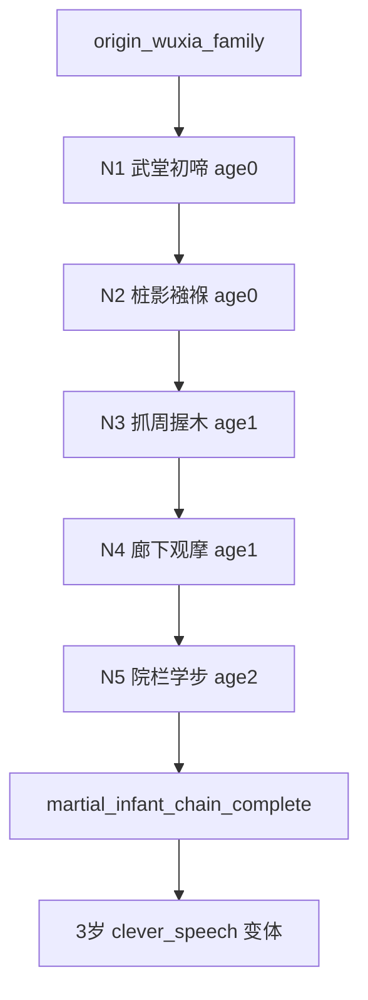

# Quest Spec：武林世家 · 0～2 岁被动事件链

**Quest ID：** `quest_martial_infant_passive_0_2`  
**状态：** 待审批（内容策划稿，非实现指令）  
**真源：** `docs/designs/early-childhood-agency-and-opening-experience-optimization.md`（§5、§6）、`docs/designs/p16-stage-agency-rules.md`、`docs/test-reports/api-browser-playtest-experience-2026-06-17.md`  
**范围：** 出身「武林世家」玩家在 **0～2 岁**的专属被动叙事链（5 节点）  
**非目标：** 不改 runtime、不写代码、不设计 8 岁以上内容、不引入玩家主动规划

---

## 1. 任务摘要

| 项 | 说明 |
| --- | --- |
| **玩家幻想** | 「我生在练武人家，尚在襁褓便听木桩作响、风声过耳；筋骨在长辈怀抱与院中光影里悄悄长实，却还不是我自己在练功。」 |
| **情绪曲线** | 洪亮降生 → 风声好奇 → 抓周小惊喜 → 模仿被护 → 院中蹒跚；武侠氛围来自**环境与家人**，非婴儿闯江湖。 |
| **与全局 spine 关系** | 补充 `birth_wuxia_family` / `toddler_exploration` 之间的 filler；同年叙事用武林变体，**不**结算 `qinggong` / `internalSkill` / `martialPower` 跳变。 |
| **操作形态** | 每期仅「继续」；不出现规划三选一或占位句「本期暂无强求的江湖变故…」。 |

---

## 2. 前置与入口

| 条件 | 说明 |
| --- | --- |
| **出身 flag** | `origin_wuxia_family` |
| **年龄带** | `age ∈ [0, 2]` |
| **Agency** | `passive_progression` / `story_automatic`；`planningOptions.length === 0` |
| **互斥** | 不触发书香/商贾/边疆专属被动链 |
| **入口** | 全局降生 spine ack 后首期被动 filler，或 0 岁首期被动叙事 |

---

## 3. 核心循环

```
触发（年龄 + 上一节点完成 + origin_wuxia_family）
  → 展示被动叙事（主叙事区非空）
  → 结算微弱属性 / 写入 flag
  → 玩家点「继续」→ 时间推进 1 期
  → 下一节点或 filler / spine 锚点
```

**可观测指标：** 0～2 岁本链节点完成率 ≥80%；每期继续前叙事非空率 100%。

---

## 4. 事件节点（5）

> 数值约束：仅 `constitution`、`health`、`comprehension`；单节点单属性 **Δ ∈ {0, +1}**；禁止 `chivalry` / `internalSkill` / `martialPower` / `money` / `qinggong` 跳变。  
> Flag 前缀 `martial_infant_*`；**不**直接触发 `martial_path` 或功力成长。

### 节点 1：武堂初啼

| 字段 | 内容 |
| --- | --- |
| **节点 ID** | `martial_infant_01_hall_birth` |
| **触发年龄** | 0 岁 |
| **叙事要点** | 府中设小练武场，檐下悬「克己」木匾。你初啼洪亮，院中正练木人桩的叔伯收势回头，祖母笑说：「哭声有劲，像咱家的人。」 |
| **禁用** | 不写「玩耍练功」「拜师」「闯荡江湖」；不写婴儿主动习武。 |
| **Flag** | `martial_infant_hall_birth` |
| **数值** | `constitution +0～+1`（建议 +1） |
| **下一触发** | 0 岁内再 **1～2 期** → 节点 2 |

---

### 节点 2：桩影襁褓

| 字段 | 内容 |
| --- | --- |
| **节点 ID** | `martial_infant_02_swaddle_dummy` |
| **触发年龄** | 0 岁（节点 1 后） |
| **叙事要点** | 你躺在院中竹榻襁褓里，午后日光把木人桩的影子拉得很长。父亲抱你比划出拳，拳风掠过额发，你只觉呼呼作响；母亲在一旁叮嘱「轻些，别吓着孩儿」。 |
| **禁用** | 不写玩家安排练武；不写内功、功力、侠义结算。 |
| **Flag** | `martial_infant_swaddle_dummy` |
| **数值** | `constitution +0～+1`（建议 +1） |
| **下一触发** | 推进至 **1 岁** 或累计 **2～3 期** → 节点 3 |

---

### 节点 3：抓周握木

| 字段 | 内容 |
| --- | --- |
| **节点 ID** | `martial_infant_03_grasp_wood` |
| **触发年龄** | 1 岁 |
| **叙事要点** | 抓周案上摆着毛笔、算盘、小木剑与布偶。你爬过去，小手攥住木剑鞘不放——叔公抚掌，父亲却按剑说「先养筋骨，兵器不急」。 |
| **禁用** | 不得写成玩家选择；不写正式传艺、门派任务。 |
| **Flag** | `martial_infant_grasp_wood`；可选 `p9_early_martial_seed`（非路径锁定） |
| **数值** | `constitution +0～+1`（建议 +1） |
| **下一触发** | 1 岁段内 **1～2 期** → 节点 4 |

---

### 节点 4：廊下观摩

| 字段 | 内容 |
| --- | --- |
| **节点 ID** | `martial_infant_04_corridor_watch` |
| **触发年龄** | 1 岁（节点 3 后；可与 `toddler_exploration` 同年） |
| **叙事要点** | 你在榻上翻身学爬，常爬到廊下看兄长练桩。你有样学样挥小拳头，被长辈笑着扶住腰：「架势像，力气还不够。」 |
| **与 spine 对齐** | 若触发 `toddler_exploration`，用本节点文案替换通用版；**不**结算 `qinggong+1`，体魄以本节点 `constitution` 表达。 |
| **Flag** | `martial_infant_corridor_watch` |
| **数值** | `constitution +0～+1`（建议 +1）；`comprehension +0` |
| **下一触发** | 节点 4 完成后 **2～3 期** → 节点 5 |

---

### 节点 5：院栏学步

| 字段 | 内容 |
| --- | --- |
| **节点 ID** | `martial_infant_05_yard_steps` |
| **触发年龄** | 2 岁（链收官） |
| **叙事要点** | 你扶着练武场边木栏蹒跚学步，木人桩被撞得轻轻晃动。有一回脚下一软，被师兄一把捞起——「练武先练稳，莫急。」 |
| **禁用** | 不写轻功、切磋、外出游历；冲突仅限「险些摔倒—被扶住」。 |
| **Flag** | `martial_infant_yard_steps`；`martial_infant_chain_complete` |
| **数值** | `constitution +0～+1`（建议 +1）；`health +0～+1`（可选 +1，须叙事点名调养） |
| **下一触发** | 链结束 → 3 岁 `clever_speech` 武林变体 / 通用 filler |

---

## 5. 流程图



**节奏目标：** 0～2 岁约 **8～12 期** passive 中本链 5 节点各命中 1 次；过渡句可用「院中又过了一季，风声依旧」，禁用规划占位句。

---

## 6. 数值与 Flag 总表

| 节点 | 体魄 | 健康 | 悟性 |
| --- | --- | --- | --- |
| N1 | +1 | — | — |
| N2 | +1 | — | — |
| N3 | +1 | — | — |
| N4 | +1 | — | — |
| N5 | +1 | +0～+1 | — |

**全链预算：** 体魄 +5（实施可压至 +3，与书香链总量对齐时 N1/N3 各改为 +0）；悟性 **0**；侠义/内功/功力/银两 **无变化**。

| Flag | 用途 |
| --- | --- |
| `martial_infant_hall_birth` | 后续家传武学氛围回调 |
| `martial_infant_swaddle_dummy` | 木人桩/练武场事件加权 |
| `martial_infant_grasp_wood` | 4 岁童年偏好「玩耍」选项叙事加成 |
| `martial_infant_corridor_watch` | 3～7 岁观摩练武事件前置 |
| `martial_infant_yard_steps` | 2 岁收官 |
| `martial_infant_chain_complete` | 防重复播放 |
| `p9_early_martial_seed`（可选） | 极弱武路倾向 |

---

## 7. 下游衔接（设计备注）

| 年龄 | 衔接 |
| --- | --- |
| 3 岁 | `clever_speech` 变体：可提「抓周握木剑」「廊下学拳」 |
| 4 岁 | `childhood_preference`「继续玩耍」与 `martial_infant_grasp_wood` 呼应 |
| 5～7 岁 | 轻量 2 选如「雨后泥地玩耍」/「在廊下看兄长练桩」 |

---

## 8. 风险与缓解

| 风险 | 缓解 |
| --- | --- |
| 婴儿期像「玩家在练功」 | 全文被动视角；禁用「玩耍练功」规划选项 |
| 与 `birth_wuxia_family` 重复 | N1 偏「武堂环境」，出生 spine 偏「世家宣告」；实施合并展示时 N1 效果延后 |
| 体魄全链 +5 偏高 | 配置压至 +3，与 `ageActionStatCaps` 单节点 Δ≤1 一致 |
| 与 `infant_swaddle_martial` 重复 | 节点 2 为真源文案 |

---

## 9. 验收标准（Given / When / Then）

### AC-1：Agency 形态

- **Given** 武林世家，角色 0～2 岁  
- **When** 连续推进 10 期并完成本链 5 节点  
- **Then** 全程无规划三选一；**0 次**「听先生讲课」「玩耍练功」「与玩伴相处」

### AC-2：链完整性

- **Given** `origin_wuxia_family` 且未完成 `martial_infant_chain_complete`  
- **When** 从 0 岁推进至 2 岁  
- **Then** N1→N5 各触发 1 次，顺序不乱，完成后不重复

### AC-3：数值常识

- **Given** 仅结算本链 5 节点  
- **When** 链收官  
- **Then** `chivalry`/`internalSkill`/`martialPower`/`money` 无变化；单节点任意属性 Δ≤1；体魄链增量 ≤5（建议配置 ≤3）

### AC-4：叙事可见性

- **Given** 任意本链节点  
- **When** 显示「继续」  
- **Then** 主叙事区非空，可复述本期情节与属性变化

### AC-5：出身差异化

- **Given** 武林世家 vs 书香门第，各推进至 2 岁  
- **When** 对比叙事 ID  
- **Then** 重合度 <50%；书香链不得出现「木人桩」「练武场」「抓周握木剑」等同构句

### AC-6：实机痛点

- **Given** API 浏览器模式书香/武林各测一局  
- **When** 0～2 岁推进  
- **Then** 无「玩耍练功」首回合侠义暴涨路径；占位句 0 次

---

## 10. 实施提示

- 配置落点：`origin-infant-passives.json` 或扩展 `infantPassiveNarratives.ts` 有序子链 `martial`。  
- 合并 `infant_swaddle_martial` → 节点 2，避免双份体魄 +1。
