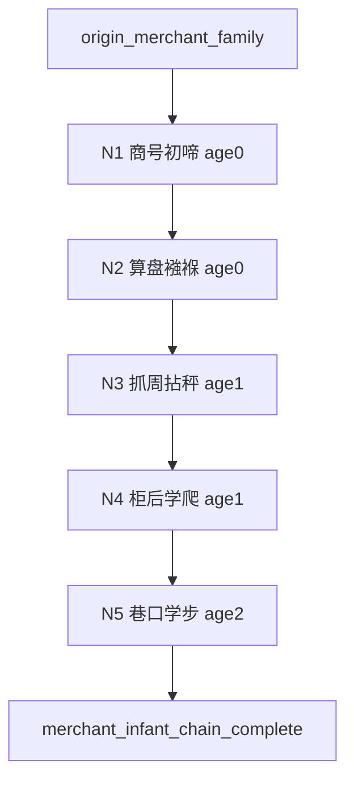

# Quest Spec：商贾之家 · 0～2 岁被动事件链

**Quest ID：** `quest_merchant_infant_passive_0_2`  
**状态：** 待审批（内容策划稿，非实现指令）  
**真源：** `docs/designs/early-childhood-agency-and-opening-experience-optimization.md`（§5、§6）、`docs/designs/p16-stage-agency-rules.md`、`docs/test-reports/api-browser-playtest-experience-2026-06-17.md`  
**范围：** 出身「商贾之家」玩家在 **0～2 岁**的专属被动叙事链（5 节点）  
**非目标：** 不改 runtime、不写代码、不设计 8 岁以上内容、不引入玩家主动规划

---

## 1. 任务摘要

| 项 | 说明 |
| --- | --- |
| **玩家幻想** | 「我生在殷实商号，尚在襁褓便听算盘与市井声；察言观色不是我在算计，而是管家、母亲与巷口人声一点点渗进来。」 |
| **情绪曲线** | 热闹降生 → 算盘好奇 → 抓周小趣 → 铺中摸爬 → 巷口初步；富足但不写「经商致富」玩家决策。 |
| **与全局 spine 关系** | 补充出生/学步锚点间 filler；同龄用商贾变体，**禁止** 0～2 岁 `money` 跳变（银两变化留待 8 岁+ 或正式事件）。 |
| **操作形态** | 每期仅「继续」；无规划三选一、无占位句。 |

---

## 2. 前置与入口

| 条件 | 说明 |
| --- | --- |
| **出身 flag** | `origin_merchant_family` |
| **年龄带** | `age ∈ [0, 2]` |
| **Agency** | `passive_progression` / `story_automatic`；`planningOptions.length === 0` |
| **互斥** | 不触发书香/武林/边疆专属被动链 |
| **入口** | 降生 spine ack 后首期被动 filler |

---

## 3. 核心循环

```
触发（年龄 + 上一节点 + origin_merchant_family）
  → 被动叙事 → 微弱属性 / flag → 继续 → 下一节点
```

**可观测指标：** 节点完成率 ≥80%；叙事非空率 100%。

---

## 4. 事件节点（5）

> 数值约束：仅 `constitution`、`health`、`comprehension`；单节点 Δ≤1；禁止 `money` / 侠义 / 内功 / 功力跳变。  
> Flag 前缀 `merchant_infant_*`；**不**触发 `merchant_path` 或营商行动池。

### 节点 1：商号初啼

| 字段 | 内容 |
| --- | --- |
| **节点 ID** | `merchant_infant_01_shop_birth` |
| **触发年龄** | 0 岁 |
| **叙事要点** | 你生在商号后宅，前堂正谈一笔绸缎买卖。初啼时伙计报喜「添了小东家」，掌柜父亲收住算盘匆匆赶来，母亲笑着说「别惊着孩子，生意晚一刻不打紧。」 |
| **禁用** | 不写银两增减、不写玩家「经商」「安排」；婴儿无自主交易行为。 |
| **Flag** | `merchant_infant_shop_birth` |
| **数值** | `comprehension +0～+1`（建议 +1，表对人声的敏感） |
| **下一触发** | 0 岁内 **1～2 期** → 节点 2 |

---

### 节点 2：算盘襁褓

| 字段 | 内容 |
| --- | --- |
| **节点 ID** | `merchant_infant_02_swaddle_abacus` |
| **触发年龄** | 0 岁 |
| **叙事要点** | 你被放在账房旁软榻，算盘声此起彼伏。管家逗你抓铜钱玩，叮当作响；母亲抱你时叮嘱账房先生「声小些，别吵醒小少爷/小姐。」 |
| **禁用** | 不写「数钱」「赚银」；铜钱仅为玩具。 |
| **Flag** | `merchant_infant_swaddle_abacus` |
| **数值** | `comprehension +0～+1`（建议 +1） |
| **下一触发** | **1 岁** 或 **2～3 期** → 节点 3 |

---

### 节点 3：抓周拈秤

| 字段 | 内容 |
| --- | --- |
| **节点 ID** | `merchant_infant_03_grasp_scale` |
| **触发年龄** | 1 岁 |
| **叙事要点** | 抓周案上摆着毛笔、木剑、小秤砣与布老虎。你爬过去，小手抓住秤砣不放——祖父大笑「将来是掌秤的人」，母亲却道「先学会走路说话要紧。」 |
| **禁用** | 被动见证，非玩家选择；不写营商、跑商、社交应酬。 |
| **Flag** | `merchant_infant_grasp_scale`；可选 `p9_early_merchant_seed` |
| **数值** | `comprehension +0～+1`（建议 +1） |
| **下一触发** | 1 岁段 **1～2 期** → 节点 4 |

---

### 节点 4：柜后学爬

| 字段 | 内容 |
| --- | --- |
| **节点 ID** | `merchant_infant_04_counter_crawl` |
| **触发年龄** | 1 岁（可与 `toddler_exploration` 同年） |
| **叙事要点** | 你在后铺软毯上学爬，把一小摞样布推落满地。伙计要捡，母亲拦道「孩子淘气罢了」；你抓着布角咿呀笑，像模像样地递还给来人。 |
| **与 spine 对齐** | 替换通用学步探索文案；**不**结算 `qinggong`；体魄用 `constitution` 表达活动量。 |
| **Flag** | `merchant_infant_counter_crawl` |
| **数值** | `constitution +0～+1`（建议 +1） |
| **下一触发** | **2～3 期** → 节点 5 |

---

### 节点 5：巷口学步

| 字段 | 内容 |
| --- | --- |
| **节点 ID** | `merchant_infant_05_alley_steps` |
| **触发年龄** | 2 岁（链收官） |
| **叙事要点** | 母亲抱你到巷口看市集，人声鼎沸。下来学步时你扶着货摊边沿挪了两步，险些被路人撞到，被父亲一把揽进怀里：「闹市眼杂，先在家中长大些。」 |
| **禁用** | 不写独立经商、游历、银两得失；冲突为「闹市小险—被护住」。 |
| **Flag** | `merchant_infant_alley_steps`；`merchant_infant_chain_complete` |
| **数值** | `constitution +0～+1`（建议 +1）；`health +0～+1`（可选 +1） |
| **下一触发** | 链结束 → 3 岁 `clever_speech` 商贾变体 |

---

## 5. 流程图



**节奏目标：** 0～2 岁 **8～12 期** 中 5 次有情节叙事；过渡句如「铺中又过了一季，算盘声依旧」。

---

## 6. 数值与 Flag 总表

| 节点 | 体魄 | 健康 | 悟性 |
| --- | --- | --- | --- |
| N1 | — | — | +1 |
| N2 | — | — | +1 |
| N3 | — | — | +1 |
| N4 | +1 | — | — |
| N5 | +1 | +0～+1 | — |

**全链预算：** 悟性 +3、体魄 +2、健康 +0～+1；**银两恒不变**（实机 0～5 岁银两归零问题不在本链制造新跳变）。

| Flag | 用途 |
| --- | --- |
| `merchant_infant_shop_birth` | 商号背景回调 |
| `merchant_infant_swaddle_abacus` | 账房/市井氛围加权 |
| `merchant_infant_grasp_scale` | 4 岁偏好与营商伏笔 |
| `merchant_infant_counter_crawl` | 3～7 岁看摊类事件前置 |
| `merchant_infant_alley_steps` | 2 岁收官 |
| `merchant_infant_chain_complete` | 防重复 |
| `p9_early_merchant_seed`（可选） | 极弱商路倾向 |

---

## 7. 下游衔接

| 年龄 | 衔接 |
| --- | --- |
| 3 岁 | `clever_speech` 变体：学比划「一两」「半两」 |
| 4 岁 | `childhood_preference` 与察言观色倾向 |
| 5～7 岁 | 「随母亲娘家门探亲」/「留在家中听祖父讲古」类 2 选 |

---

## 8. 风险与缓解

| 风险 | 缓解 |
| --- | --- |
| 0～2 岁出现银两变化 | 本链禁止 `money` effect；P16 抑制 `business` 行动 |
| 像「育儿经商模拟」 | 无玩家决策；仅环境音与亲人行为 |
| 与 `infant_swaddle_merchant` 重复 | 节点 2 为真源 |
| 商贾=唯利是图刻板 | 母亲护子、父亲暂缓生意等温情句平衡 |

---

## 9. 验收标准（Given / When / Then）

### AC-1：Agency

- **Given** 商贾之家，0～2 岁  
- **When** 推进 10 期并完成 5 节点  
- **Then** 无规划三选一；无「你可安排日常行动」

### AC-2：链完整性

- **Given** `origin_merchant_family`，链未完成  
- **When** 0→2 岁正常推进  
- **Then** N1→N5 各 1 次，完成后不重复

### AC-3：数值

- **Given** 仅本链结算  
- **When** 链收官  
- **Then** `money`/`chivalry`/`internalSkill`/`martialPower` 无变化；悟性 ≤+3；单节点 Δ≤1

### AC-4：叙事可见

- **When** 显示「继续」  
- **Then** 主叙事区非空

### AC-5：出身差异

- **Given** 商贾 vs 武林，各至 2 岁  
- **Then** 叙事 ID 重合度 <50%；无「木人桩」「营寨号声」等同构混入商贾链

### AC-6：实机

- **When** 0～2 岁 API 推进  
- **Then** 无占位句；无首回合属性荒谬跳变

---

## 10. 实施提示

- 合并 `infant_swaddle_merchant` → 节点 2。  
- 商贾链悟性偏高、体魄偏低，与武林链形成对照，满足 P2-2 互斥被动要求。
