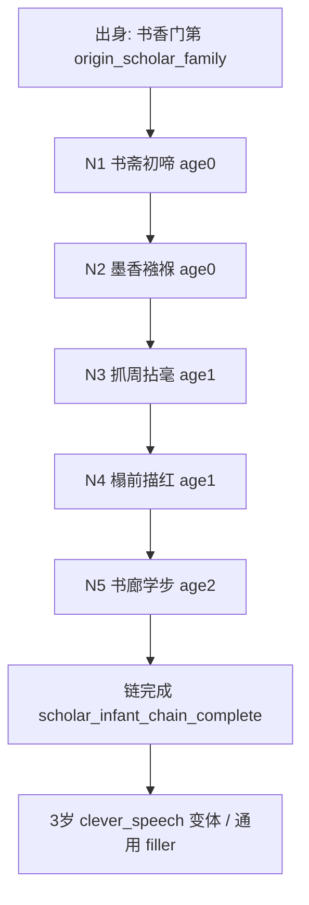

# Quest Spec：书香门第 · 0～2 岁被动事件链

**Quest ID：** `quest_scholar_infant_passive_0_2`  
**状态：** 待审批（内容策划稿，非实现指令）  
**真源：** `docs/designs/early-childhood-agency-and-opening-experience-optimization.md`（§5、§6）、`docs/designs/p16-stage-agency-rules.md`、`docs/test-reports/api-browser-playtest-experience-2026-06-17.md`  
**范围：** 出身「书香门第」玩家在 **0～2 岁**的专属被动叙事链（5 节点）  
**非目标：** 不改 runtime、不写代码、不设计 8 岁以上内容、不引入玩家主动规划

---

## 1. 任务摘要

| 项 | 说明 |
| --- | --- |
| **玩家幻想** | 「我生在读书人家，尚在襁褓便被诗书与墨香包围；成长不由我安排，而是由父母、书斋与家族期许塑形。」 |
| **情绪曲线** | 安宁 → 温馨期许 → 小小惊喜（抓周）→ 身体成长 → 语言萌芽；全程低冲突、高代入，无江湖任务感。 |
| **与全局 spine 关系** | 本链**补充** `childhoodEvents` 中出生/学步等锚点之间的 filler 期；与 `birth_*`、`toddler_exploration` **不互斥**，但同龄叙事须用书香变体文案，避免与武林/商贾/边疆重合。 |
| **操作形态** | 每期仅「继续」；**不出现**规划三选一、占位句「本期暂无强求的江湖变故…」。 |

---

## 2. 前置与入口

| 条件 | 说明 |
| --- | --- |
| **出身 flag** | `origin_scholar_family`（玩家已选「书香门第」） |
| **年龄带** | `age ∈ [0, 2]`（含边界） |
| **Agency** | `passive_progression` / `story_automatic`；`planningOptions.length === 0` |
| **互斥** | 不触发 `origin_merchant_family` / `origin_wuxia_family` / `origin_frontier` 专属被动链 |
| **入口** | 完成全局「降生」类 spine 后的**第一期被动 filler**，或 0 岁首期被动叙事（若出生与出身合并展示，则本链从节点 2 起接龙） |

---

## 3. 核心循环

```
触发（年龄 + 上一节点完成 + 出身 flag）
  → 展示被动叙事（主叙事区非空）
  → 结算微弱属性 / 写入 flag
  → 玩家点「继续」
  → 时间推进 1 期（建议 1 季度，与 lite action 对齐）
  → 下一节点或回落通用 filler / 等待 spine 锚点
```

**可观测指标：** 0～2 岁内本链节点完成率 ≥80%（正常推进不跳号）；每期继续前叙事非空率 100%。

---

## 4. 事件节点（5）

> 数值约束（全链）：仅 `constitution`（体魄）、`health`（健康）、`comprehension`（悟性）；单节点单属性 **Δ ∈ {0, +1}**；禁止 `chivalry` / `internalSkill` / `martialPower` / `money` / `qinggong` 等跳变。  
> Flag 以 `scholar_infant_*` 为前缀，供 3～7 岁变体与路径亲和铺垫，**不**直接触发 `scholar_path`（该 flag 保留给 13+ 或正式抉择线）。

### 节点 1：书斋初啼

| 字段 | 内容 |
| --- | --- |
| **节点 ID** | `scholar_infant_01_hall_birth` |
| **触发年龄** | 0 岁（出生后首期被动；若与全局 `birth_*` 同屏，本节点文案并入出生段，效果延后至节点 2 结算） |
| **叙事要点** | 府邸深处有藏书阁，檐下挂「耕读传家」旧匾；你初啼时，父亲正捧线装书卷，母亲以帕拭泪。族老低语：「此子生在书卷气里。」 |
| **禁用** | 不出现「你选择」「安排」「练功」「江湖」；不写婴儿自主行为。 |
| **Flag** | `scholar_infant_hall_birth` |
| **数值** | `comprehension +0～+1`（建议 +1，表「耳濡目染」） |
| **下一触发** | 同 0 岁内再推进 **1～2 期** → 节点 2；若当期有全局出生 spine，则在出生事件 ack 后进入节点 2 |

---

### 节点 2：墨香襁褓

| 字段 | 内容 |
| --- | --- |
| **节点 ID** | `scholar_infant_02_swaddle_ink` |
| **触发年龄** | 0 岁（节点 1 完成后；最晚不迟于 0 岁段结束） |
| **叙事要点** | 你被裹在软绸襁褓里，搁在书案旁竹榻。父亲低声诵《千家诗》，母亲临帖描红，墨香与奶香混在一起；你有时被墨渍染指，被娘笑着拭去。 |
| **禁用** | 不写「听先生讲课」式学龄文案；不写银两、买纸裁量。 |
| **Flag** | `scholar_infant_swaddle_ink` |
| **数值** | `comprehension +0～+1`（建议 +1） |
| **下一触发** | 时间推进至 **1 岁** 或累计 **2～3 期** passive → 节点 3 |

---

### 节点 3：抓周拈毫

| 字段 | 内容 |
| --- | --- |
| **节点 ID** | `scholar_infant_03_grasp_brush` |
| **触发年龄** | 1 岁 |
| **叙事要点** | 抓周案上摆着铜钱、小木剑、算盘与毛笔。你爬过去，小手攥住毛笔不放——父亲目中一亮，母亲却笑说「先养身子，莫急」。族中有人悄议科举，有人只道「孩子闹着玩」。 |
| **禁用** | 不得写成玩家「选择抓毛笔」；须为被动见证。不写内功、侠义、拜师。 |
| **Flag** | `scholar_infant_grasp_brush`；可选倾向 `p9_early_scholar_seed`（权重 +1，非路径锁定） |
| **数值** | `comprehension +0～+1`（建议 +1）；`constitution +0`（本节点不强调体魄） |
| **下一触发** | 1 岁段内再 **1～2 期** → 节点 4；或年龄至 1 岁中后期 |

---

### 节点 4：榻前描红

| 字段 | 内容 |
| --- | --- |
| **节点 ID** | `scholar_infant_04_trace_red` |
| **触发年龄** | 1 岁（节点 3 之后；可与全局 `toddler_exploration` 同年，文案取书香变体） |
| **叙事要点** | 你在榻上翻身、学爬，常把案角镇纸推落。母亲不责，只握你小手在描红纸上划圈；父亲笑言「字未识得，先识墨气」。 |
| **与 spine 对齐** | 若同期触发 `toddler_exploration`，优先使用本节点文案，**不**结算 `qinggong+1`；体魄以本节点 `constitution` 替代。 |
| **Flag** | `scholar_infant_trace_red` |
| **数值** | `constitution +0～+1`（建议 +1）；`comprehension +0` |
| **下一触发** | 年龄 **≥1 岁且节点 4 完成** 后，累计 **2～3 期** → 节点 5 |

---

### 节点 5：书廊学步

| 字段 | 内容 |
| --- | --- |
| **节点 ID** | `scholar_infant_05_corridor_steps` |
| **触发年龄** | 2 岁（本链收官；完成后退出专属链） |
| **叙事要点** | 你扶着书廊栏杆蹒跚学步，两侧书架高过头顶。你咿呀指着插图册，父亲蹲身念旁白；有一回险些磕到角，被乳母及时抱住——「书要读，骨头也要长结实。」 |
| **禁用** | 不写轻功、闯荡、与玩伴「相处」类主动社交；冲突仅限「小险—被抱住」级别。 |
| **Flag** | `scholar_infant_corridor_steps`；`scholar_infant_chain_complete` |
| **数值** | `constitution +0～+1`（建议 +1）；`health +0～+1`（可选 +1，表偶发磕碰后调养，须叙事点名） |
| **下一触发** | 链结束 → 2～3 岁通用 passive filler 或等待 **3 岁** `clever_speech` 书香变体（「伶牙俐齿」可引用 `scholar_infant_grasp_brush` 伏笔） |

---

## 5. 流程图



**节奏目标：** 0～2 岁全程约 **8～12 期** passive 推进中，本链 5 节点至少命中 **5 次**有情节叙事；其余期可用极短过渡句（如「你在书声里又过了一季」），但不得使用规划占位句。

---

## 6. 数值与 Flag 总表

| 节点 | 体魄 | 健康 | 悟性 | 累计悟性约 |
| --- | --- | --- | --- | --- |
| N1 | — | — | +1 | +1 |
| N2 | — | — | +1 | +2 |
| N3 | — | — | +1 | +3 |
| N4 | +1 | — | — | +3 |
| N5 | +1 | +0～+1 | — | +3 |

**全链属性预算：** 悟性 +3、体魄 +2、健康 +0～+1；侠义/内功/功力/银两 **恒为 0 变化**（出身抉择 `origin.json` 的大额加成不在本链重复结算）。

| Flag | 用途 |
| --- | --- |
| `scholar_infant_hall_birth` | 3 岁+ 文案可回调「书卷气里出生」 |
| `scholar_infant_swaddle_ink` | 启蒙/描红类事件加权 |
| `scholar_infant_grasp_brush` | 4 岁「童年偏好」读书选项叙事加成 |
| `scholar_infant_trace_red` | 幼童期习字事件前置 |
| `scholar_infant_corridor_steps` | 2 岁收官，健康小险伏笔 |
| `scholar_infant_chain_complete` | 退出本链，防止 0～2 岁重复播放 |
| `p9_early_scholar_seed`（可选） | 极弱文路倾向，不锁路径 |

---

## 7. 下游衔接（仅设计备注，本轮不实施）

| 年龄 | 衔接 |
| --- | --- |
| 3 岁 | `clever_speech` 书香变体：可提及「抓周攥笔」「跟父亲念诗」 |
| 4 岁 | `childhood_preference` 中「专心读书」选项与 `scholar_infant_grasp_brush` 呼应 |
| 5～7 岁 | 轻量 2 选安排（如「随母探亲」/「听祖父讲古」），见总方案 §6.3 |

---

## 8. 风险与缓解

| 风险 | 缓解 |
| --- | --- |
| 与全局 `birth_*` / `toddler_exploration` 重复 | 同年以书香变体**替换**通用文案；禁止重复结算轻功/内功 |
| 被动期过长显枯燥 | 5 节点分布在 0/1/2 三岁，平均每岁 ≥1 条小情节；过渡句 ≤1 句 |
| 数值仍被出身抉择叠加导致「首回合 +13 侠义」 | 本链不触碰侠义/内功；验收单独审计 `origin.json`（见总方案 P0-2） |
| 与 `infant_swaddle_scholar`  catalog 条目重复 | 实施时合并为同一 ID 或本链节点 2 引用 catalog 文案 |

---

## 9. 验收标准（Given / When / Then）

### AC-1：Agency 形态

- **Given** 玩家已选书香门第，角色年龄在 0～2 岁  
- **When** 连续推进 10 期并完成本链全部 5 节点  
- **Then** 全程 `planningOptions.length === 0`；UI **0 次**出现「听先生讲课」「玩耍练功」「与玩伴相处」或「你可安排日常行动」

### AC-2：链完整性与顺序

- **Given** `origin_scholar_family` 且未完成 `scholar_infant_chain_complete`  
- **When** 从 0 岁正常 passive 推进至 2 岁  
- **Then** 按序触发 N1→N5，各节点 `event_record` 或等价日志 **各 1 次**；链完成后不再重复 N1～N5

### AC-3：数值常识

- **Given** 仅结算本链 5 节点（不含出身抉择与其他系统）  
- **When** 链收官时查看属性  
- **Then** `chivalry`、`internalSkill`、`martialPower`、`money` 相对链起点 **无变化**；`comprehension` 增量 ≤3；`constitution` 增量 ≤2；单节点任意属性 Δ≤1

### AC-4：叙事可见性

- **Given** 任意本链节点展示期  
- **When** 玩家看到「继续」按钮  
- **Then** 主叙事区有本期文案（非空）；玩家能复述「发生了什么、属性是否变化」

### AC-5：出身差异化

- **Given** 分别用书香门第与边疆军户推进至 2 岁  
- **When** 对比 0～2 岁被动叙事 ID 列表  
- **Then** 重合度 **<50%**（至少 3 条为书香专属，边疆不得出现「描红」「藏书阁」「抓周拈毫」等同构文案）

### AC-6：与实机痛点对照

- **Given** API 浏览器模式，复用 `api-browser-playtest-experience-2026-06-17.md` §9 脚本  
- **When** 书香门第开局连续推进至 ≥2 岁  
- **Then** 不再出现实机报告中的「0 岁首回合玩耍练功致侠义 +13」路径；0～2 岁占位句「暂无江湖变故…」出现 **0 次**

---

## 10. 实施提示（供后续 Story，本轮不执行）

- 建议配置落点：`src/data/lines/origin-infant-passives.json` 或扩展 `infantPassiveNarratives.ts` 为有序子链。  
- 节点 ID 与 flag 命名以本文为准，便于与 `quest_scholar_infant_passive_0_2` 追溯。  
- 合并现有 `infant_swaddle_scholar` 时，以节点 2 文案为真源，避免双份 +1 悟性。
