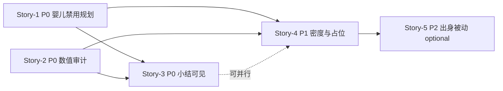

# 幼年开局体验优化 — 实施拆解稿

**状态：** 已实施（Story-1～5，2026-06-18）  
**真源：** `docs/designs/early-childhood-agency-and-opening-experience-optimization.md`  
**约束：** `docs/designs/p16-stage-agency-rules.md`、`docs/PRD/p16-wuxia-origin-driven-growth-and-composite-destiny.md`（US-005）  
**证据：** `docs/test-reports/api-browser-playtest-experience-2026-06-17.md`  
**范围：** 0～7 岁开场；不含少年/成年/结局线

---

## 0. 文档用途

将已批准的体验方案拆为可并行 Story，每条附现状对照、改动触点、Given/When/Then 验收与回滚说明。  
**本稿为实施指令；代码改动须按 Story 逐条审批后执行。**

---

## 1. 现状对照表（方案项 → 代码/API → Gap）

| 优先级 | 方案项 | 目标行为 | 当前实现（路径 / 符号） | Gap |
| --- | --- | --- | --- | --- |
| **P0-1** | 0～2 岁禁用主动规划 | 连续推进仅「继续」/自动剧情，**0 次**三行动规划 | `HeadlessEngineSessionImpl.getSessionPhase()`（`src/headless/session/HeadlessEngineSessionImpl.ts:452-459`）：无事件且存活 → 恒为 `active_planning`；`GameEngineIntegration.getAvailableActiveActions()`（`src/core/GameEngineIntegration.ts:2623-2630`）→ `resolveChildhoodActionPalette()`（`src/p16/childhoodAgency.ts:112-147`）对 **0～7 岁**均返回最多 3 项 lite 行动；`SessionPhase` 合约（`src/contracts/sessionProgression.ts:20-25`）**无** `passive_progression` 相位 | P16 仅抑制 adult P7 五行动，**未按 0～2 岁关闭规划期**；API/本地均 0 岁即可见「玩耍练功/听先生讲课/与玩伴相处」 |
| **P0-2** | 首回合数值审计 | 0 岁被动叙事后侠义=0、内功=0；无荒谬跳变 | `childhoodActionCatalog.ts` `action_childhood_training` rewards：`externalSkill`/`martialPower`（`src/data/childhoodActionCatalog.ts:14-17`）；`ActionResultResolver.resolveActiveAction()`（`src/core/activePlanning/ActionResultResolver.ts:48-58`）**无年龄上限**；`origin.json` 书香选项 `origin_scholar_family`：`chivalry+4, internalSkill+4, comprehension+8`（`src/data/lines/origin.json:68-83`）；`birth_with_phenomenon` auto：`internalSkill+5`（`src/data/childhoodEvents.ts:104-107`） | 实机 +13 侠义等多为 **出身抉择 + 首动行动 + 时间推进** 叠加；配置与 resolver 均未对 **0～2 岁** 限制 `chivalry`/`internalSkill`/`martialPower` |
| **P0-3** | 继续前叙事/小结可见 | 点「继续」前主叙事区或小结卡非空 | API：`App.vue` `currentNode`（`src/App.vue:129-156`）`action_summary` 仅 `${actionName}已结束（${durationLabel}）`；`SessionProgressionPayload`（`src/contracts/sessionProgression.ts:92-103`）**不下发** `lastOutcomeText`/choice feedback；`handleProgressionAck` 后 `applyProgressionResponse` 清空反馈链（`src/composables/useApiGameEngine.ts:79-91`）；`GameScreen` 继续钮在 `active_planning` 隐藏（`src/components/GameScreen.vue:137`）但切到 `action_summary`/`story_automatic` 后叙事常空 | 行动小结卡有结构化字段但 **缺实际 delta 叙事**；自动剧情 ack 后进入规划期时 **主区空白** |
| **P1-1** | 降低占位规划文案 | 0～7 岁极少见「暂无江湖变故…」 | 硬编码于 `App.vue:134,171`；婴儿期仍显示「你可安排日常行动」 | 占位与婴儿被动体验冲突；35 步内高频（实机报告 §3.1） |
| **P1-2** | 提高被动/spine 密度 | 35 步内 ≥8 条有情节叙事 | `golden-line-spine.json` timelineAnchors 0～7 岁仅 birth/origin/toddler/clever/preference/enlightenment（`src/data/golden-line-spine.json:74-79`）；`selectEvent()` 无事件时回落 `active_planning`（`HeadlessEngineSessionImpl.getNextEvent` → null）；spine `pickOne` 与 `maxTriggers` 使锚点事件 **一次性** 后长期 filler | 正式剧情 35 步内约 2～3 次（实机 §4） |
| **P1-3** | 行动池按龄分段 | 5 岁与 1 岁选项池不得相同；4 岁前无日常规划 | `EARLY_CHILDHOOD_MAX_AGE=7`（`childhoodAgency.ts:13`）仅控制 `maxCategories`（3 vs 4），**不区分 0～2 / 3～4 / 5～7**；5 岁与 1 岁同源 palette 逻辑 | 无解锁感；与方案「4 岁童年偏好为首个正式抉择」不一致 |
| **P2-1** | 属性变化必有叙事来源 | 抽 5 次属性变化 100% 可对应叙事 | `buildActiveActionSummaryDisplay`（`src/core/activePlanning/activeActionSummaryBuilder.ts:25-43`）展示配置区间摘要，**非实际 delta**；扰动池无年龄过滤（`DisturbanceResolver.ts:4-8`） | 数值变但文案未点名 |
| **P2-2** | 出身驱动被动序列 | 0～7 岁至少 3 条互斥被动/变体 | `getOriginChildhoodEventMultiplier()`（`src/p16/originSurfaces.ts`）影响权重，但 0～2 岁 **无专属被动事件表**；`childhoodEvents.ts` 出生/学步/伶牙俐齿 **出身无关** | 重玩叙事重合度高 |
| **P2-3** | 武侠感铺垫 | 家族/异象/地域伏笔，非成人江湖任务 | 扰动池含「有人邀你切磋」「街市江湖传闻」（`DisturbanceResolver.ts`），**0 岁可触发** | 婴儿期江湖味错位 |

---

## 2. 实施切片（Story）

### 依赖与并行关系



| Story | 优先级 | 可与…并行 | 阻塞 |
| --- | --- | --- | --- |
| Story-1 | P0 | Story-2（不同文件为主） | Story-4 内容填充依赖相位形态 |
| Story-2 | P0 | Story-1 | — |
| Story-3 | P0 | Story-1 后期 / Story-2 | 最好在 1+2 定稿后联调 |
| Story-4 | P1 | Story-3 | Story-5 |
| Story-5 | P2（可选） | — | Story-4 spine 槽位 |

**建议实施顺序：** Story-1 → Story-2 → Story-3 → Story-4 →（可选）Story-5

---

### Story-1：0～2 岁禁用主动规划（runtime/API phase）

**目标：** 0～2 岁 `phase` 不进入「选行动」；仅 `story_event` / 被动推进 / 单「继续」。

#### 改动触点（最小方案）

| 层 | 文件 | 改动要点 |
| --- | --- | --- |
| 常量 | `src/p16/childhoodAgency.ts` | 新增 `INFANT_MAX_AGE = 2`；`shouldOfferActivePlanning(age)` / `isPassiveInfantBand(age)` |
| Palette | `src/p16/childhoodAgency.ts` | `resolveChildhoodActionPalette`：若 `age <= INFANT_MAX_AGE` 返回 `[]` |
| Phase | `src/headless/session/HeadlessEngineSessionImpl.ts` | `getSessionPhase()`：婴儿期无 `currentEvent` 且无 pending summary → **`passive_progression`**（新相位）而非 `active_planning` |
| 合约 | `src/contracts/sessionProgression.ts` | `SessionPhase` 增加 `'passive_progression'`；payload 增加 `passiveNarrative?: { title, text }`（或复用 `nextEvent` 占位） |
| 推进 | `HeadlessEngineSessionImpl` + `server/.../gameService.ts` | 新 ack：`passive_continue` 或复用 `story_automatic` 语义：推进 1 季度 → `getNextEvent` → 若仍无事件则生成/选取 **婴儿被动叙事**（见 Story-4 配置） |
| 本地 | `src/composables/useNewGameEngine.ts` | `getNextEvent` 分支与 API 对齐：婴儿期 `isActiveActionMode=false`，显示继续 |
| UI | `src/App.vue`, `src/components/GameScreen.vue` | `passive_progression`：不渲染三行动；主区显示被动文案；隐藏「安排日常行动」占位 |
| 测试 | `tests/p16OriginDestinyTests.ts` 或新建 `tests/earlyChildhoodAgencyTests.ts` | 年龄 0/1/2 palette 为空；phase 断言 |

#### 验收标准

| ID | Given | When | Then |
| --- | --- | --- | --- |
| S1-AC-1 | API 模式，书香门第，角色 **0～2 岁** | 连续 ack/推进 **10 期** | `planningOptions.length === 0` 全程；UI **0 次**出现「听先生讲课」「玩耍练功」「与玩伴相处」 |
| S1-AC-2 | 同上 | 每期界面 | 仅「继续」或自动剧情；**无**「规划本期人生」+ 三行动 |
| S1-AC-3 | `npm run gate:playability` | Story-1 合并后 | 0 blockers；既有童年 agency 测试仍 pass（age≥3 不受影响） |

**自动化（建议）：**

```bash
npm run test -- earlyChildhoodAgency   # 待新增脚本或纳入 p16 tests
npx tsx tests/headless/p72SessionPhase.test.ts  # 扩展婴儿 phase 用例
```

#### 假设与待确认

- **A1：** 0～2 岁被动推进时间步长默认 **1 季度**（与 lite action `duration` 对齐）；若策划要「1 月 1 点击」需另议。
- **Q1：** `passive_progression` 是否扩展至 **3～4 岁**（方案幼童前期亦禁止日常规划）——本 Story **仅 0～2**；3～4 建议 Story-4 或 follow-up。

---

### Story-2：童年行动 effect 数值审计与分龄上限

**目标：** 0～2 岁禁止侠义/内功/功力因玩家行动跳变；5～7 岁轻量；配置可审计。

#### 改动触点

| 层 | 文件 | 改动要点 |
| --- | --- | --- |
| 配置 | `src/data/childhoodActionCatalog.ts` | 为每项增加 `ageBandCaps?: Record<stat, {max, min}>` 或 `forbiddenStatsUnderAge: 3` |
| Resolver | `src/core/activePlanning/ActionResultResolver.ts` | 读取 `player.age`，对 `chivalry`/`internalSkill`/`martialPower`/`money` 等应用 **分龄 clamp**；0～2 岁仅允许 `constitution`/`comprehension` 且 `maxDelta≤1` |
| 事件 | `src/data/lines/origin.json`, `src/data/childhoodEvents.ts` | 审计：`birth_with_phenomenon` 的 `internalSkill+5` 改为 flag/延后；`origin_scholar_family` 大 jump 保留在 **age≥4 童年偏好后** 或改为倾向 flag |
| 扰动 | `src/core/activePlanning/DisturbanceResolver.ts` | `age <= 7` 禁用或替换扰动池 |
| 报告 | `src/p16/reportBuilder.ts` | gate 报告增加「0 岁 max delta」探测 |
| 测试 | `tests/p16OriginDestinyTests.ts` | 固定 seed 下 0 岁执行 lite training，断言 `chivalry===0 && internalSkill===0` |

#### 验收标准

| ID | Given | When | Then |
| --- | --- | --- | --- |
| S2-AC-1 | 0 岁，完成 birth 自动叙事后（**未**进入规划） | 查看 `player` | `chivalry===0`，`internalSkill===0`，`martialPower` 变化 ≤1 |
| S2-AC-2 | 1 岁，若仍允许 lite 行动（Story-1 未合并时）或被动事件结算 | 单回合 | 无 `chivalry`/`internalSkill` 单回合 +5 以上 |
| S2-AC-3 | `npm run gate:p16` | Story-2 合并后 | pass；`p16-gate-latest` 无新增 fail |

**自动化：**

```bash
npm run gate:p16
npm run test -- p16OriginDestiny
```

#### 假设与待确认

- **A2：** P0-2 验收锚点为「**首段被动叙事后**」，不含 `origin_background`（age 1）抉择；若产品要求出身选择也推迟到 4 岁，属 **范围外** 大改，需单独立项。
- **Q2：** `origin_scholar_family` 的 `comprehension+8` 是否改为 `+2`——建议 Story-2 仅 clamp **0～2 岁被动路径**，出身抉择在 age 1 保留小幅加成。

---

### Story-3：继续前叙事/行动小结可见性

**目标：** 每次点「继续」前，玩家能复述本期后果。

#### 改动触点

| 层 | 文件 | 改动要点 |
| --- | --- | --- |
| API 合约 | `src/contracts/sessionProgression.ts` | 增加 `periodSummary?: { headline, body, statDeltas[] }` |
| Volatile | `HeadlessEngineSessionImpl` | `executeActiveAction` / `executeChoice` / `progressAutomatic` 后写入 `volatile.periodSummary` |
| Mapper | `server/src/services/sessionProgressionMapper.ts` | 映射 `periodSummary` 到 payload |
| Summary 构建 | `src/core/activePlanning/activeActionSummaryBuilder.ts` | 用 `actionResult.deltas` 生成 **实际** 收益文案（非 min~max 区间） |
| 客户端 | `src/App.vue`, `src/composables/useApiGameEngine.ts` | `currentNode` / `GameScreen` 在 `action_summary`、`story_automatic` ack 前展示 `periodSummary`；choice feedback 在切 phase 前 **保留 1 帧** |
| 本地 | `useNewGameEngine.ts` | 与 API 同构，避免双轨漂移 |

#### 验收标准

| ID | Given | When | Then |
| --- | --- | --- | --- |
| S3-AC-1 | API 模式任意一期结束 | 看到「继续」按钮前 | 主叙事区或小结卡 `text.length > 0`，且含 **本期动作/事件名** |
| S3-AC-2 | 执行「玩耍练功」后 `action_summary` | 查看小结卡 | 展示 **实际** stat delta（如「外功+1」），非仅「已结束」 |
| S3-AC-3 | `story_automatic` ack 后进入 `passive_progression`/`active_planning` | 继续前 | 上一段自动剧情文案仍可见，或 `periodSummary.body` 复述 |

**手工复验：** 见本文 §6 复验脚本。

#### 假设与待确认

- **A3：** 优先 **扩展 payload** 而非让客户端缓存 choice response——以 API 权威为准。
- **Q3：** 是否在 `action_summary` phase 同时展示 `GameScreen` 结构化 feedback 列表——建议 **是**（复用本地模式 `visibleStatImpacts`）。

---

### Story-4：0～7 岁被动/spine 密度与占位文案治理

**目标：** 占位 ≤3 次/35 步；婴儿期无占位；spine 叙事加密。

#### 改动触点

| 层 | 文件 | 改动要点 |
| --- | --- | --- |
| UI 文案 | `src/App.vue` | 按 `player.age` 分支：`age<=2` 不用占位句；`age<=7` 改为「家中又过了一季…」类短叙事 |
| 被动内容 | 新建 `src/data/infantPassiveNarratives.ts` 或 JSON | 0～2 岁每季 1 条被动文案（出身 tag 加权）；供 Story-1 `passive_continue` 消费 |
| Spine | `src/data/childhoodEvents.ts` / `lines/general.json` | 增加 0～2 岁 **出身变体** 2～3 条/出身；`clever_speech` 等补出身 fork |
| 调度 | `GameEngineIntegration.selectEvent` 或 golden-line 助手 | 0～7 岁 **story-gap** 时优先抽 passive filler 而非立即 `active_planning` |
| 测试 | 手工 + 可选 headless 计数 | 35 步内统计 placeholder 字符串出现次数 |

#### 验收标准

| ID | Given | When | Then |
| --- | --- | --- | --- |
| S4-AC-1 | 0～5 岁 API 实机 | 推进 35 步 | 「本期暂无强求的江湖变故」出现 **≤3 次** |
| S4-AC-2 | 0～2 岁 | 任意期 | **0 次**该占位句 |
| S4-AC-3 | 0～7 岁 35 步 | 统计非空叙事 | ≥8 条含 **具体情节**（非纯占位）的 `periodSummary` 或 `story_event.text` |

**依赖：** Story-1 相位 + Story-3 小结（否则「有叙事」不可观测）。

---

### Story-5（可选）：出身分叉被动事件文案/配置

**目标：** P2-2：换出身开局，前 7 年叙事清单重合度 <50%。

#### 改动触点

| 层 | 文件 | 改动要点 |
| --- | --- | --- |
| 配置 | `src/data/lines/origin-infant-passives.json`（建议） | 书香/武林/商贾/边疆各 ≥3 条 0～2 岁互斥被动 |
| 选择 | `src/p16/originSurfaces.ts` + event loader | `getOriginChildhoodEventMultiplier` 参与被动叙事挑选 |
| 验证 | `docs/test-reports/` | 两出身各跑 7 年 eventId 列表 diff |

#### 验收标准

| ID | Given | When | Then |
| --- | --- | --- | --- |
| S5-AC-1 | 书香 vs 边疆，各模拟至 7 岁 | 对比 `eventHistory` 叙事 id | 重合度 <50% |
| S5-AC-2 | `npm run gate:p16` | 合并后 | origin variance slice 仍 pass |

---

## 3. 风险与回滚

| 风险 | 影响 | 缓解 / 回滚 |
| --- | --- | --- |
| **API vs 本地节奏分叉** | P7 文档已记录；婴儿 passive 若只改 API 会加剧分叉 | 以 **HeadlessEngineSessionImpl + GameEngineIntegration** 单点为准；`useNewGameEngine` 薄适配；回滚：移除 `passive_progression` 分支，恢复 `active_planning` |
| **`gate:playability` 依赖童年主动行动** | 模拟器记录在 age 2/5/7 选 `action_childhood_training`（`p8-playability-gate-latest.md`） | Story-1 后更新 persona runner：**0～2 岁改 ack passive**；回滚 gate 基线 JSON |
| **合约破坏性变更** | 新 `SessionPhase` 旧客户端不识别 | `sessionProgression` 文档注明版本；旧客户端见 `nextEvent` 回退推断；feature flag `P16_INFANT_PASSIVE=1`（可选） |
| **仅改 UI 不改 phase** | 隐藏选项但服务端仍 `active_planning` | **禁止**；必须以 `getSessionPhase` 为准 |
| **Story-4 内容先行** | 在错误循环上堆文案 | 治理决策：**P0 未完成不扩写**（方案 §8） |

**回滚顺序：** Story-5 → Story-4 内容 → Story-3 → Story-2 resolver → Story-1 phase（逐 Story revert）。

---

## 4. 实施计划摘要（待审批）

| 批次 | Story | 预估触点文件数 | 门禁 |
| --- | --- | --- | --- |
| 迭代 1 | 1 + 2 + 3 | ~12 | `gate:p16`, `gate:playability`, 浏览器 §6 |
| 迭代 2 | 4 | ~6 + 内容 | 浏览器 35 步计数 |
| 迭代 3 | 5（可选） | ~4 + 内容 | origin variance slice |

**不在范围：** 8～12 岁 P16 allowlist 变更、少年/成年线、P20 全生命周期、顶栏角色名（P3）。

---

## 5. 待确认点（审批前）

| # | 问题 | 建议默认 |
| --- | --- | --- |
| Q1 | 3～4 岁是否在本阶段一并禁用日常规划？ | **是**（与方案 §3 表一致），可并入 Story-1 扩展 `INFANT_TODDLER_MAX_AGE=4` 或 Story-4 |
| Q2 | `origin_background`（1 岁四选一）是否保留？ | **保留**；与「4 岁童年偏好」分层：1 岁出身 / 4 岁兴趣 |
| Q3 | 婴儿被动推进步长 | 1 季度/点击 |
| Q4 | `passive_progression` 命名或复用 `story_event`？ | 新 phase，避免与自动 spine 混淆 |

---

## 6. 复验脚本与记录

### 6.1 环境

```bash
npm run p6b:serve   # 终端 A
npm run dev         # 终端 B → http://localhost:5200
```

流程见 `docs/test-reports/api-browser-playtest-experience-2026-06-17.md` §9。

### 6.2 检查清单（P0 同批）

| # | 检查项 | 预期 | 结果 |
| --- | --- | --- | --- |
| R1 | 0～2 岁连续 10 期 | 0 次规划三选一 | ☐ 待测 |
| R2 | 0 岁首段被动叙事后 | 侠义=0、内功=0 | ☐ 待测 |
| R3 | 每次点「继续」前 | 主叙事/小结非空 | ☐ 待测 |
| R4 | 35 步内占位文案 | 「暂无江湖变故」≤3 次 | ☐ 待测（Story-4） |

### 6.3 复验记录

| 日期 | 执行人 | Story 范围 | 结果摘要 |
| --- | --- | --- | --- |
| 2026-06-18 | agent | Story-1～5 | `gate:p16` pass；`gate:playability` 0 blockers；`p16OriginDestinyTests` + `p72SessionPhase` pass |
| — | — | 基线 | `api-browser-playtest-experience-2026-06-17.md` |

---

## 7. 变更日志

| 版本 | 日期 | 说明 |
| --- | --- | --- |
| 0.2 | 2026-06-18 | Story-1～5 实施完成；自动化门禁通过 |
| 0.1 | 2026-06-18 | 初稿：现状对照 + 5 Story + 验收/风险 |
