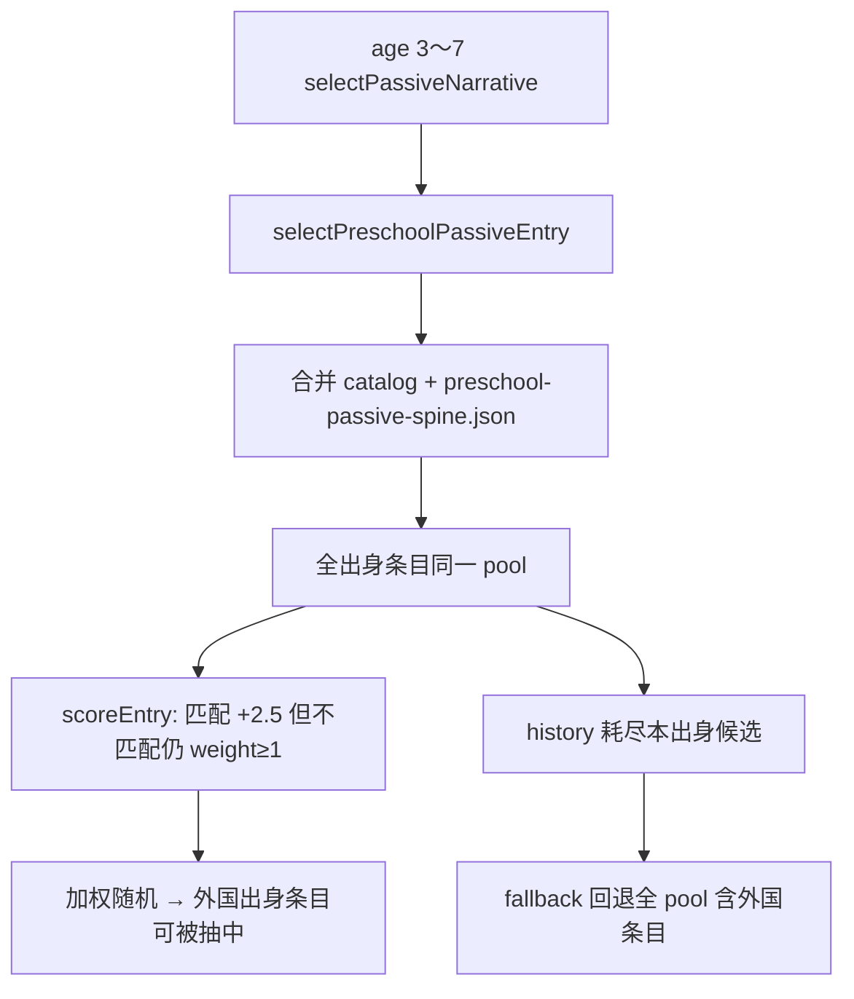

# 幼童期被动叙事 · 出身隔离设计规则（Stage-5）

**状态：** 已实施（见 `docs/test-reports/early-childhood-preschool-origin-isolation-stage5-closure.md`）  
**问题：** 3～7 岁 passive filler **跨出身串味**（如书香门第出现「营中操练」）  
**关联 PRD：** `docs/PRD/early-childhood-preschool-origin-isolation.md`  
**对比真源：** Stage-3 的 0～2 岁有序链（`originInfantPassiveChain.ts`）已严格按 `origin_*` flag 隔离

---

## 1. 现象与证据

| 来源 | 观察 |
| --- | --- |
| 玩家实机 | 书香门第开局，幼童期出现边疆/武林/商贾向文案 |
| `api-browser-playtest-stage2.md` step 18 | age 4 · 书香 · passive · **营中操练**（`child_frontier_drill`） |
| Stage-2 审计 | 书香×边疆至 7 岁叙事重合 **70.6%**（Stage-3 修 0～2 链后链节点 0%，但 3～7 filler 仍共享池） |

---

## 2. 根因（设计层）



| # | 根因 | 代码位置 |
| --- | --- | --- |
| R1 | **软加权、硬过滤缺失** — 非本出身条目 base weight=1，仍可中奖 | `preschoolPassiveSpine.ts` `scoreEntry` |
| R2 | **池耗尽回退** — `candidates` 空时用**全年龄 pool**，含所有 `originTags` | `selectPreschoolPassiveEntry` L71–74 |
| R3 | **与 0～2 策略不一致** — 0～2 用 `selectOrderedOriginInfantPassive` 严格 flag；3～7 未沿用隔离策略 | `infantPassiveNarratives.ts` L94–103 |
| R4 | **catalog 合并** — `infantPassiveNarrativeCatalog` 3～7 段四出身 + `preschool-passive-spine.json` 同池竞争 | `mergedPreschoolCatalog()` |

**非本问题（但易混淆）：**

- **`p22_origin_frontier_orphan` 等 spine 事件** — 来自 `selectEvent()` 剧情调度，不是 passive filler；若出现在错误出身，属 **spine 触发条件** 问题，本 Stage 不覆盖（可另开 PRD）。

---

## 3. 目标策略：出身硬隔离 + 中立兜底

### 3.1 条目 eligibility（3～7 岁 passive）

条目 **可进入候选池** 当且仅当：

```
originTags ∩ { playerOriginTag, 'neutral' } ≠ ∅
且
originTags 中除 'neutral' 外不存在与 playerOriginTag 冲突的专属 tag
```

**简化实现规则（推荐）：**

| 条目 originTags | 书香玩家 | 武林玩家 | 商贾玩家 | 边疆玩家 |
| --- | --- | --- | --- | --- |
| `['scholar']` | ✅ | ❌ | ❌ | ❌ |
| `['martial']` | ❌ | ✅ | ❌ | ❌ |
| `['merchant']` | ❌ | ❌ | ✅ | ❌ |
| `['frontier']` | ❌ | ❌ | ❌ | ✅ |
| `['neutral']` | ✅ | ✅ | ✅ | ✅ |
| `['scholar','neutral']` | ✅ | ❌ | ❌ | ❌ |

**禁止：** 外国出身条目以低权重「偶尔出现」——这不是「增加随机性」，是 **叙事穿帮**。

### 3.2 池耗尽回退

1. **主池：** 本出身 + neutral，且 `!history.has(id)`
2. **次池：** 仅 **neutral** 且未 history
3. **末池：** `preschool_passive_gap` 年龄文案（`resolvePlanningPlaceholderText`），**禁止** 回退到含外国 origin 的全量 pool

### 3.3 与 Stage-3 对齐原则

| 年龄段 | 选择策略 |
| --- | --- |
| 0～2 | 有序 quest 链（已实现） |
| 3～7 | **硬过滤** + 加权（权重只在合法池内竞争） |
| 8+ | 本 Stage 不定义 |

可选增强（非 P0）：3～7 每出身 3～4 条 **轻量顺序 micro-chain**（无 completeFlag 亦可），在合法池内优先 dequeue——US 可标为 P2。

---

## 4. 配置约束

- 每条 `preschool-passive-spine.json` / catalog 条目必须声明 `originTags`
- 禁止 `originTags: []` 或缺失（CI 校验）
- 禁止单条多专属出身（如 `['scholar','martial']`），除非拆成两条

---

## 5. 验收标准（摘要）

| ID | Given | Then |
| --- | --- | --- |
| AC-1 | 书香，age 4，模拟 50 次 passive | **0 次** `martial/merchant/frontier` 专属 id |
| AC-2 | 四出身各 age 3～7 各 30 次 | 外国专属 id 出现率 **0%** |
| AC-3 | 书香 API 35 步 | step log **无** `child_frontier_drill` 等外国 id |
| AC-4 | history 耗尽本出身条目 | 仅 neutral / gap，不出现外国条目 |

---

## 6. 非目标

- 修改 0～2 岁 quest 链
- 修改 spine 事件（`clever_speech`、`p22_*`）触发条件
- 8～12 岁 palette
- 新增大量叙事文本（本 Stage 以 **隔离逻辑** 为主；缺条目用 neutral/gap 补）

---

**版本：** 0.1 · 2026-06-20
