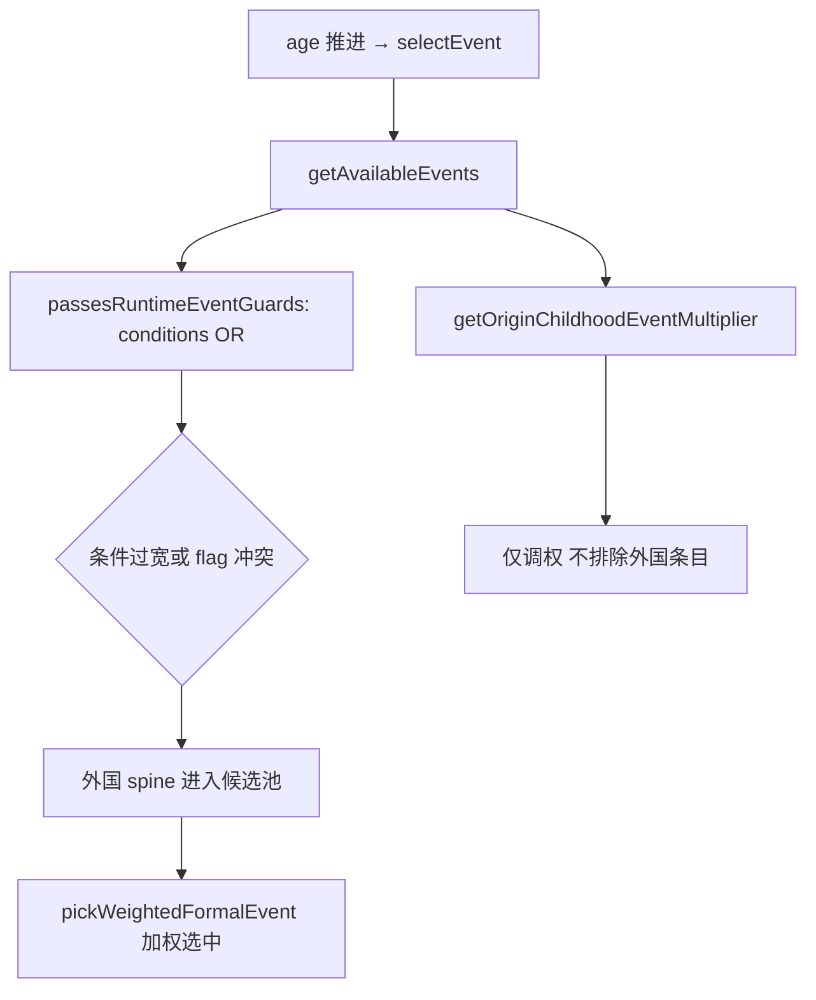

# Spine / story_event · 出身隔离设计规则（Stage-6）

**状态：** 待实施  
**问题：** 3～7 岁及幼年 **spine / story_event** 跨出身串味（非 passive filler）  
**关联 PRD：** `docs/PRD/early-childhood-spine-origin-isolation.md`  
**对比真源：** Stage-5 已在 `preschoolPassiveSpine.ts` 对 passive 做硬隔离；本 Stage 覆盖 `selectEvent()` / `getAvailableEvents()` 路径

---

## 1. 现象与证据

| 来源 | 观察 |
| --- | --- |
| `api-browser-playtest-stage2.md` step 7 | 书香门第 · age 2 · **story_event** · `p22_origin_frontier_orphan`（边关遗孤） |
| Stage-5 收口 | passive 串味已 0%；spine 串味 **明确列为残余** |
| `early-childhood-origin-divergence-stage2.md` | 四出身叙事 ID 列表混有 `p22_origin_frontier_orphan` 与多出身 infant id |

**与 Stage-5 的边界：**

| 路径 | Phase | Stage-5 | Stage-6 |
| --- | --- | --- | --- |
| `selectPassiveNarrative` | `passive_progression` | ✅ 已硬隔离 | 不改 |
| `selectEvent` | `story_event` | 未覆盖 | **本 Stage** |
| `dailyEventSystem` 回退 | 视事件 | 未覆盖 | 幼年 band 纳入门禁 |

---

## 2. 根因（设计层）



| # | 根因 | 说明 |
| --- | --- | --- |
| R1 | **无主出身权威** | `traitProfile.startingFlags`（如 `origin_poor_family`）与 `origin_background` 所选 flag（如 `origin_scholar_family`）可 **并存**；条件 `origin_poor_family \|\| origin_frontier_family` 对书香局仍可能为真 |
| R2 | **配置 flag 名不一致** | `p22_origin_frontier_orphan` 条件用 `origin_frontier_family`，实际出身为 `origin_frontier`（`origin.json`）；边疆玩家可能 **永远抽不到**，外国玩家却可能靠 R1 误触发 |
| R3 | **软加权非硬过滤** | `getOriginChildhoodEventMultiplier` 只调 material/guidance 权重，**不排除** `authoringSemantics.stageFit` 与玩家出身不符的条目 |
| R4 | **stageFit 未运行时 enforcement** | P21 `stageFit` 仅用于生产矩阵评分；`getAvailableEvents` 不读 `stageFit` 做 negative gate |
| R5 | **P22 live_ops 与条件解耦** | `live_ops_expansion` 需 `p22_live_ops_active`；弱 archetype trait 可激活 live_ops，再叠加 R1 使 P22 出身事件进入错误局 |

**Stage-2 书香 + orphan 最可能链路（假设）：**

1. `traitSystem.generateProfile()` → `poor_family` → `startingFlags: origin_poor_family` + `p22_live_ops_active`
2. age 1 玩家选「书香门第」→ 追加 `origin_scholar_family`
3. `p22_origin_frontier_orphan` 条件 `origin_poor_family` 为真 → 通过 `passesRuntimeEventGuards`
4. 加权选中 → 书香 age 2 出现边关遗孤

---

## 3. 目标策略：主出身权威 + spine 硬隔离

### 3.1 主出身 flag（canonical primary origin）

与 Stage-5 `resolveOriginTags` 对齐：**以 `origin_background` 四选一 flag 为唯一主出身**，优先级高于 trait `startingFlags`。

| 主出身 flag | passive tag | stageFit 信号（示例） |
| --- | --- | --- |
| `origin_scholar_family` | scholar | `origin_scholar`, `scholarly_identity` |
| `origin_wuxia_family` | martial | `origin_martial`, `martial_identity` |
| `origin_merchant_family` | merchant | `origin_merchant`, `wealth_identity` |
| `origin_frontier` | frontier | `origin_frontier`, `frontier_military` |

**规则：** age ≥ 1 且已触发 `origin_background` 后，spine 门禁 **只认** 上表主 flag；trait 层 `origin_poor_family` / `origin_streetborn` 等 **不得** 单独解锁外国专属 spine。

### 3.2 Spine 条目 eligibility（0～7 岁，可扩展至 12）

事件 **可进入 `getAvailableEvents` 候选** 当且仅当：

```
age > 7  → 本 Stage 默认放行（或 follow-up 扩 band）
age ∈ [0,7] 且 event 无 origin-exclusive 语义 → 放行（clever_speech 等通用童年）
age ∈ [0,7] 且 event 有 origin-exclusive 语义 → 必须 match 主出身
```

**origin-exclusive 判定（任一满足）：**

- `metadata.authoringSemantics.stageFit` 含 `origin_*` / `*_identity` 且映射到四出身之一
- `metadata.tags` 含 `origin` + 单出身向 tag（`frontier`, `scholar`, …）
- `conditions` 表达式引用 `origin_*_family` / `origin_frontier`（审计标记为需与主 flag 一致）

**硬规则：** 外国专属 spine **不得以低权重偶尔出现** — 与 Stage-5 passive 同原则。

### 3.3 配置层修复（与代码 gate 双轨）

| 条目 | 修复方向 |
| --- | --- |
| `p22_origin_frontier_orphan` | 条件改为 `origin_frontier`（非 `_family`）；移除 `origin_poor_family` OR，或拆为独立 poor 事件 |
| 其他 P22 / identity-* | 审计 `origin_*` 表达式与 `origin.json` flag 名一致 |
| thresholds.required/forbidden | 与主 flag 权威一致；禁止仅靠 trait startingFlags |

### 3.4 实现落点（推荐）

| 层级 | 文件 | 动作 |
| --- | --- | --- |
| 共享 | 新模块或 `originInfantPassiveChain.ts` 旁 | `resolvePrimaryOriginFamilyFlag(state)` |
| 门禁 | `GameEngineIntegration.passesRuntimeEventGuards` 或 `getAvailableEvents` | age ≤ 7 调用 `isSpineOriginEligible(event, primaryFlag)` |
| 配置 | `p22-content-expansions.json` 等 | US-004 修正条件 |
| 验证 | `tests/spineOriginIsolationTests.ts` | 四出身 × age 1～7 story_event 矩阵 |

**不推荐：** 仅在 `pickWeightedFormalEvent` 降权 — 与 Stage-5 前 passive 策略相同，已证明不足。

---

## 4. 验收口径

| 指标 | 目标 |
| --- | --- |
| 四出身 age 1～7 story_event 抽样 | 外国专属 id **0%** |
| 书香 35 步 API（Stage-2 脚本扩展） | spine bleed flags **0** |
| `p22_origin_frontier_orphan` 书香局 | **不得出现** |
| 边疆局 age 1～3 | orphan **可出现**（条件修正后） |
| Stage-5 passive 指标 | 不回归 |
| `gate:p16` + `gate:playability` | pass |

---

## 5. 非目标

- passive filler（Stage-5 已交付）
- neutral passive 标题去重（Stage-7）
- 8～12 全量 spine 重写（本 Stage 代码 gate 可扩至 12，内容审计 P1 聚焦 0～7）
- 重写 `getOriginChildhoodEventMultiplier` 为唯一手段

---

**设计版本：** 0.1 · 2026-06-19
