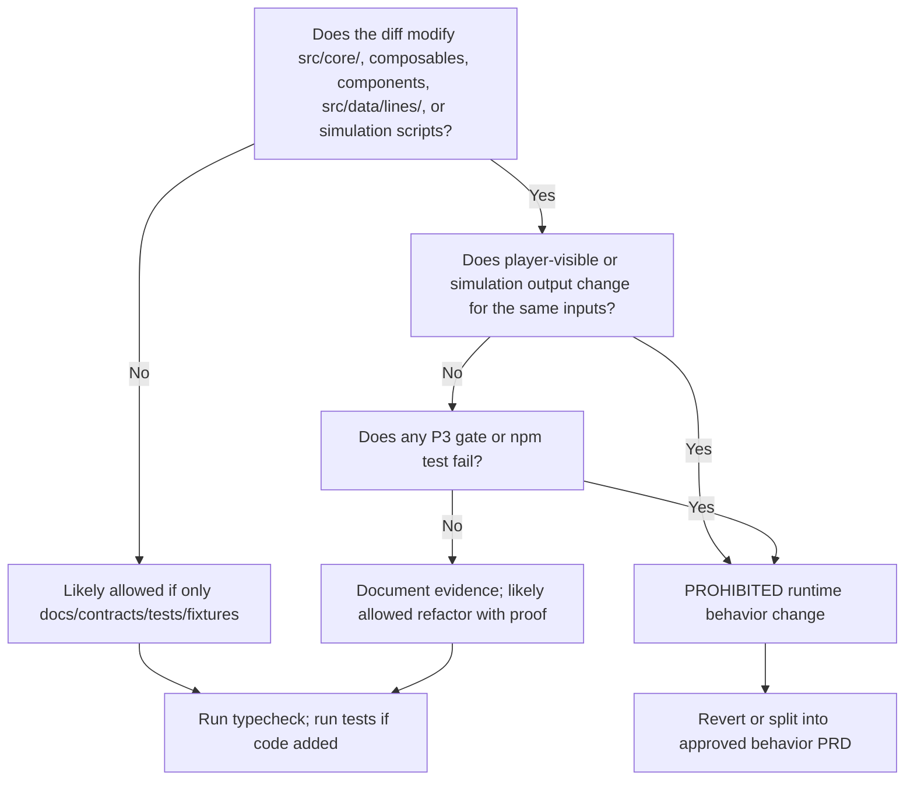

# P4 Non-Runtime-Behavior Guardrails (US-002)

**Story:** P4 US-002 — Define P4 Non-Runtime-Behavior Guardrails

**Authority inputs:** `docs/PRD/p4-engine-contract-and-service-boundary.md`, `docs/test-reports/p4-engine-boundary-baseline.md` (US-001).

**Purpose:** Freeze what P4 may add and what it must not change so contract work does not destabilize the proven P3 experience. All subsequent P4 sessions must cite this document before modifying code or docs.

---

## 1. P4 phase intent

P4 is an **architecture-readiness** phase. It defines contracts and service boundaries for future frontend/backend separation. It does **not** implement a backend, database, accounts, cloud saves, or a mini-program.

**Core rule (FR-10):** P4 must not change gameplay runtime behavior.

**Regression rule (FR-11):** P3 experience gates must remain valid after P4. Do not relax P3 thresholds, cohorts, or enforcement to make P4 land.

---

## 2. Allowed additions

P4 may add the following **without** changing runtime gameplay behavior, provided each addition is isolated from the hot path unless explicitly approved by a later PRD:

| Category | Examples | Placement guidance | Runtime coupling |
| --- | --- | --- | --- |
| **TypeScript contract types** | `GameStateSnapshot`, choice execution request/response, replay log, event catalog metadata, save schema policy types | Prefer a dedicated contract module (e.g. `src/contracts/` or `src/types/contracts/`) | Types must not replace or shadow runtime `GameState`, `EventLoader`, or choice execution APIs |
| **Schema / policy definitions** | Field classifications (persisted, derived, volatile, deprecated, forbidden); save version format; migration naming rules; API draft boundaries | `docs/` for policy; types for machine-readable shape | Documentation-only until an approved story wires validation |
| **Fixtures** | Representative 0–50 snapshot objects; choice execution request/response samples; replay log samples | `tests/fixtures/` or `src/data/contracts/` per story decision | Fixtures are parsed by tests/reports only; no gameplay loader |
| **Validation helpers** | Lightweight validators for snapshot, choice execution, replay, event catalog fixtures | Contract or test support modules | Must not run in gameplay unless explicitly imported by tests/reports |
| **Contract tests** | JSON round-trip, required metadata, forbidden-field rejection, fixture parse tests | `tests/` contract suite | No browser, backend, database, or network required |
| **Contract / boundary reports** | Baseline inventories, catalog validation reports, closure reports | `docs/test-reports/` | Read-only analysis |
| **Documentation** | Snapshot contract, adapter boundary, migration policy, extraction order | `docs/` | No local absolute paths |

### 2.1 Allowed touch surfaces (from US-001 baseline)

These layers are the **preferred** targets for P4 additions:

- **report/simulation** — `tests/GameProcessSimulator.ts`, gate scripts, contract test runners
- **New contract modules** — types, fixtures, validators with no Vue/DOM/browser imports
- **docs/** — contract specs, policies, reports

Adding exports, types, or tests that **only** consume existing engine output (e.g. serialize a snapshot from `gameEngine.getGameState()` in a test harness) is allowed when the test does not alter selection, execution, or save write paths.

### 2.2 Explicitly out of scope for P4 (even if “helpful”)

- Backend server, HTTP client, ORM, database migrations
- Account system, cloud save, mini-program runtime
- Moving event loading to a remote service
- UI redesign or new player-facing features
- Activating deferred event content or 51–80 expansion
- Replacing runtime singletons (`gameEngine`, `eventLoader`, `saveManager`) with session-scoped services

---

## 3. Prohibited changes

Unless a **later approved PRD** explicitly authorizes it, P4 must **not** change the following runtime behaviors. The US-001 baseline maps each domain to concrete entry points.

### 3.1 Event selection

**Do not change:** weighted selection, guard evaluation, cooldowns, life-path gates, reputation gates, route weighting, daily/setback fallback, or candidate pool filtering.

| Entry point | Location | Classification |
| --- | --- | --- |
| `selectEvent`, `getAvailableEvents` | `src/core/GameEngineIntegration.ts` | core engine |
| `getEventsByAge`, weight/condition queries | `src/core/EventLoader.ts` | core engine |
| `ConditionEvaluator`, `LifePathManager`, selection subsystems | `src/core/*.ts` | core engine |
| Bundled catalog JSON | `src/data/events.json`, `src/data/lines/*.json` | core engine |

**Allowed:** Document catalog boundary; add types describing future service queries; add reports comparing assets to contract — **without** changing which events load or how they are filtered at runtime.

### 3.2 Effect execution

**Do not change:** effect handler registry, stat/flag/relation mutations, route sync on flags, auto-event execution, or executor-side randomness.

| Entry point | Location | Classification |
| --- | --- | --- |
| `executeChoiceEffects`, `executeAutoEvent` | `src/core/GameEngineIntegration.ts` | core engine |
| `EventExecutor.executeEffects` and handlers | `src/core/EventExecutor.ts` | core engine |
| Subsystems invoked by executor | `IdentitySystem`, `KarmaManager`, `TraitSystem`, etc. | core engine |

**Allowed:** Contract types describing post-choice state deltas; tests that **observe** effects without modifying handlers.

### 3.3 Choice outcomes

**Do not change:** outcome branch evaluation, availability gating, headless vs UI outcome pick semantics, or which outcome runs for a given choice.

| Entry point | Location | Classification |
| --- | --- | --- |
| `isChoiceAvailable`, `consumeLastEventOutcomeNote` | `src/core/GameEngineIntegration.ts` | core engine |
| `resolveChoiceEffects`, `resolveFirstChoiceEffects` | `src/core/ChoiceOutcomeResolver.ts` | core engine |
| `handleChoice`, outcome condition eval | `src/composables/useNewGameEngine.ts` | UI adapter |
| `getNextEvent`, `processAutoEvent` | `src/composables/useNewGameEngine.ts` | UI adapter |

**Allowed:** Define request/response **shapes** for future API callers; fixtures showing example outcomes — without changing resolution logic.

### 3.4 Route logic

**Do not change:** route activation, locking, completion, failure, strong exclusions, flag sync, or persisted `routeStates` / `routeHistory` semantics.

| Entry point | Location | Classification |
| --- | --- | --- |
| `RouteStateManager` API | `src/core/RouteStateManager.ts` | core engine |
| `RouteCompatibilityRules` | `src/core/RouteCompatibilityRules.ts` | core engine |
| Flag-based route display | `src/components/GameScreen.vue`, `src/utils/playerFacingLabels.ts` | UI adapter |

**Allowed:** Snapshot contract fields for route state; contract tests validating serialized route shapes.

### 3.5 Save behavior

**Do not change:** save/write/read paths, compatibility window, version stamping, auto-save keys, export/import semantics, or hydrate → `getNextEvent` orchestration.

| Entry point | Location | Classification |
| --- | --- | --- |
| `SaveManager` | `src/core/SaveManager.ts` | persistence adapter |
| `saveCurrentGame`, `loadGameFromSave` | `src/composables/useNewGameEngine.ts` | UI adapter |
| `loadGameState` | `src/core/GameEngineIntegration.ts` | core engine |
| `P2_SAVE_SCHEMA_VERSION`, `evaluateSaveCompatibility` | `src/core/SaveManager.ts` | persistence adapter |

**Allowed:** Document save schema versioning and future migration **policy**; add types for snapshot transport — without changing what is written to storage or how incompatible saves are rejected.

### 3.6 UI behavior

**Do not change:** player-visible flow, choice presentation, feedback rendering, pacing (`requestAnimationFrame`), alerts, life memory panel behavior, or phase routing.

| Entry point | Location | Classification |
| --- | --- | --- |
| `App.vue`, `GameScreen.vue`, `StartScreen.vue`, `EndingScreen.vue` | `src/components/` | UI adapter |
| Volatile session state (`currentEvent`, `lastChoiceFeedback`, …) | `src/composables/useNewGameEngine.ts` | UI adapter |
| `generateChoiceFeedback` consumption / display | composable → `GameScreen` | UI adapter |

**Allowed:** Adapter boundary docs listing browser/Vue/DOM dependencies; no visual or interaction changes.

### 3.7 Cross-cutting prohibitions

- Do not change death logic, setback logic, difficulty tuning, or P3 trust thresholds (`docs/test-reports/p3-midlife-trust-targets.md`).
- Do not modify `GameState` runtime fields in ways that alter simulation output.
- Do not introduce new imports from contract modules into `src/core/` or composables unless the story explicitly requires it and behavior is provably unchanged.
- Do not delete or weaken existing P3 gate checks to greenwash contract work.

---

## 4. Verification commands

Run these commands to prove P4 work has not destabilized the codebase or P3 behavior. **Do not relax gate thresholds or skip gates** when they fail.

### 4.1 Minimum bar (every P4 story)

| Command | Purpose | Pass criterion |
| --- | --- | --- |
| `npm run typecheck` | TypeScript compile check (`tsc --noEmit`) | Exit 0 |

### 4.2 Test bar (stories that add or modify tests/fixtures/validators)

| Command | Purpose | Pass criterion |
| --- | --- | --- |
| `npm test` | Real test gate via `tests/runRealTestGate.ts` | Exit 0 |

Contract-only stories should still pass the full test gate unless the execution plan documents an isolated contract test entry (US-024).

### 4.3 P3 regression bar (before P4 closure and after any change that touches `src/core/`, composables, components, event data, or simulation scripts)

| Command | Purpose | Pass criterion |
| --- | --- | --- |
| `npm run gate:golden-line` | Golden-line deterministic samples (P3-GL) | Exit 0; thresholds per P3 trust targets |
| `npm run gate:midlife` | Midlife route content coverage (ages 31–50) | Exit 0 |
| `npm run gate:experience` | Experience health aggregate gate | Exit 0 |
| `npm run simulate:p3-eval` | P3-EVAL cohort simulation report | Completes; metrics within P3 trust targets |

### 4.4 Recommended command order

For documentation-only stories (e.g. US-002):

```text
npm run typecheck
```

For contract code stories (types, fixtures, validators, tests):

```text
npm run typecheck
npm test
```

Before P4 phase closure (US-028) or after any runtime-adjacent change:

```text
npm run typecheck
npm test
npm run gate:golden-line
npm run gate:midlife
npm run gate:experience
npm run simulate:p3-eval
```

### 4.5 What each P3 gate protects

| Gate | Protects against accidental changes to |
| --- | --- |
| `gate:golden-line` | Priority-route samples, payoff timing, 0–50 continuity on P3-GL |
| `gate:midlife` | Midlife route arc coverage per priority route |
| `gate:experience` | Aggregate experience health metrics (death, romance/family, contradictions, etc.) |
| `simulate:p3-eval` | Full P3-EVAL cohort deterministic outcomes and trust metrics |

Reference: `docs/test-reports/p3-midlife-trust-targets.md` for frozen thresholds and cohort definitions.

---

## 5. Classifying a prohibited runtime behavior change

Use this checklist when reviewing a P4 diff. If **any** answer below is “yes” for gameplay-facing code, treat the change as **prohibited** unless a later approved PRD explicitly allows it.

### 5.1 Quick decision flow



### 5.2 Prohibited change criteria (all apply)

A change is a **prohibited runtime behavior change** if it meets **one or more** of:

1. **Output delta** — For the same seed, save, and choice sequence, any of these differ: selected event id, choice availability, outcome id, post-choice `GameState`, route state/history, death timing, or feedback content shown to the player.
2. **Selection logic delta** — Alters weights, guards, cooldowns, life-path gates, route weighting, or candidate pools in `EventLoader` / `GameEngineIntegration` / selection subsystems.
3. **Execution logic delta** — Alters effect handlers, flag/route sync, karma, traits, endings, or auto-event side effects in `EventExecutor` or callees.
4. **Save delta** — Changes bytes written to storage, compatibility acceptance, migration on load, or hydrate behavior for an unchanged saved game.
5. **UI flow delta** — Changes screens, choice UX, pacing, alerts, or what the player sees for the same engine state.
6. **Gate regression** — Causes `gate:golden-line`, `gate:midlife`, `gate:experience`, or P3-EVAL metrics to fail without an approved threshold or cohort change in P3 docs.
7. **Threshold relaxation** — Weakens P3 gate scripts, trust targets, or sample definitions to pass without fixing root cause.

### 5.3 Allowed change patterns (not prohibited)

| Pattern | Example | Requirement |
| --- | --- | --- |
| Add-only types | New `GameStateSnapshot` interface | Must not replace runtime `GameState` |
| Add-only fixtures | JSON snapshot sample in `tests/fixtures/` | Not loaded by `EventLoader` or save path |
| Add-only validators | `validateSnapshot(fixture)` in contract module | Not imported from gameplay hot path |
| Add-only tests | Round-trip serialize fixture | Uses existing public APIs read-only |
| Documentation | This guardrails doc, snapshot contract spec | No code behavior |
| Report scripts | Catalog inventory comparing JSON to contract types | Read-only; no event rule changes |

### 5.4 Gray areas — default to prohibited until proven

| Scenario | Default classification | Proof required |
| --- | --- | --- |
| Refactor in `src/core/` with “no logic change” | Prohibited until verified | Full P3 gate suite green; spot-check identical simulation records |
| Re-export runtime type from contract module | Allowed if type-only | No runtime import cycle into core that executes on load |
| Contract validator imported in `SaveManager` | Prohibited in P4 | US-017+ may allow with explicit PRD |
| Changing `GameState` field optional/required in types | Prohibited if runtime shape or save payload changes | US-003/US-004 scope with compatibility proof |
| Fixing a “bug” found during contract work | Prohibited in P4 | File separate bugfix PRD; do not bundle with P4 |

---

## 6. Session handoff checklist

Before marking a P4 story done, confirm:

- [ ] Changes match **Allowed additions** (§2) or are documentation-only.
- [ ] No **Prohibited changes** (§3) unless explicitly authorized elsewhere.
- [ ] `npm run typecheck` passes.
- [ ] If tests/fixtures/validators were added: `npm test` passes.
- [ ] If runtime-adjacent paths were touched: full P3 regression commands (§4.3) pass.
- [ ] No P3 gate thresholds or cohorts were relaxed.
- [ ] No local absolute paths in new docs or fixtures.
- [ ] Prohibited-change classification (§5) documented in story handoff when the diff touches gray areas.

---

## 7. US-002 acceptance对照

| Acceptance criterion | Section |
| --- | --- |
| Document P4 may add types, schemas, fixtures, validation helpers, contract tests | §2 |
| Document P4 must not change event selection, effect execution, choice outcomes, route logic, save behavior, UI behavior | §3 |
| Define verification commands proving P3 behavior still passes | §4 |
| Define what counts as a prohibited runtime behavior change | §5 |
| Typecheck passes | Run `npm run typecheck` |

---

## 8. Related documents

| Document | Role |
| --- | --- |
| `docs/PRD/p4-engine-contract-and-service-boundary.md` | P4 PRD and user stories |
| `docs/test-reports/p4-engine-boundary-baseline.md` | US-001 entry-point inventory |
| `docs/test-reports/p3-midlife-trust-targets.md` | P3 frozen thresholds and cohorts |
| `docs/PRD/product-experience-governance-scope-and-guardrails.md` | Prior architecture guardrails (0–30 golden line) |

---

*P4-W0 / US-002 — architecture-readiness guardrails for contract work without gameplay drift.*
