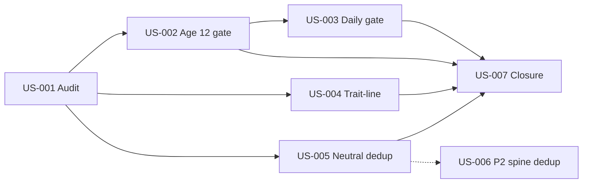

# Early Childhood Stage-7 — Planning Baseline

**Date:** 2026-06-21  
**PRD:** `docs/PRD/early-childhood-childhood-experience-stage7.md`  
**Design:** `docs/designs/childhood-experience-stage7-rules.md`  
**Inputs:** Index §5 · Stage-6 closure §4

---

## 1. Planning scope confirmation

| 用户任务 | Stage-7 US | 策略摘要 |
| --- | --- | --- |
| 扩展 spine gate 至 age 12 **或** daily 同等 gate | US-002 + US-003 | **两者都做**：常量 7→12 + daily 路径接线 |
| trait 线（poor/street）narrative bleed | US-004 | 新 trait-line eligibility 层，主出身 foreign block 不变 |
| neutral passive 标题去重 | US-005 (+ US-006 P2 spine) | 近期 title 抑制 N=5；spine neutral  repetition 可选 |

**约束核对：**

- [x] 不破坏 Stage-5/6 测试 — FR-5 明确要求回归
- [x] 验收写入 `docs/test-reports/` — 各 US 指定路径
- [x] 不产出 `.prd.json` — PRD §3 冻结

---

## 2. Stage-6 残余风险映射

| Closure §4 风险 | Stage-7 响应 | 验收报告 |
| --- | --- | --- |
| Ages 8–12 spine | US-002 常量 + 8～12 矩阵 | `spine-origin-isolation-stage7-extended-band.md` |
| `dailyEventSystem` fallback | US-003 daily gate | `daily-fallback-origin-gate-stage7.md` |
| Neutral spine repetition | US-006 (P2) | `neutral-spine-repetition-stage7.md` |
| `origin_poor_family` trait spine | US-004 trait-line | `trait-line-spine-eligibility-stage7.md` |
| `origin_frontier_family` trait 命名 | 文档记录；runtime 用 primary resolver | US-001 audit flag inventory |

---

## 3. 当前代码基线（规划快照）

| 组件 | 现状 | Stage-7 预期变更 |
| --- | --- | --- |
| `SPINE_ORIGIN_EXCLUSIVE_AGE_MAX` | `7` | → `12` |
| `GameEngineIntegration.getAvailableEvents` | 已调用 `isSpineOriginEligible` | 随常量扩展 |
| `GameEngineIntegration.selectEvent` daily 分支 | 直接 `dailyEventSystem.selectEvent` | 加 gate 过滤 |
| `DailyEventSystem.selectEvent` | trait weight only | 构建 event 后 eligibility 检查 |
| `resolvePrimaryOriginFamilyFlag` | Stage-6 共享 | 不变 |
| `selectPreschoolPassiveEntry` | Stage-5 硬隔离 | + title dedup window |
| Trait-line classifier | **不存在** | US-004 新增 |

**已知 trait-line 配置样例（待 US-001 完整审计）：**

- `p22_childhood_street_shaping` — `origin_streetborn` 条件
- `p22_origin_frontier_orphan` — 已改为 `origin_frontier` only（Stage-6）
- `traits/origins.ts` — `poor_family` → `origin_poor_family`; `streetborn` → `origin_streetborn`

---

## 4. 建议实施顺序与依赖



---

## 5. 回归门禁（实施前后必跑）

```bash
npm exec tsx tests/spineOriginIsolationTests.ts
npm exec tsx tests/preschoolOriginIsolationTests.ts
npm exec tsx tests/spineOriginConfigValidationTests.ts
npm exec tsx tests/p22ContentLibraryTests.ts
npm run gate:p16
npm run typecheck
```

**Stage-6 API 参考（US-003 后可扩展 age）：**

```bash
npm run p6b:serve
npm exec tsx scripts/runApiBrowserPlaytestStage2.ts
```

---

## 6. 验收报告清单（实施期产出）

| 报告 | US | 状态 |
| --- | --- | --- |
| `early-childhood-stage7-baseline-audit.md` | US-001 | 待实施 |
| `spine-origin-isolation-stage7-extended-band.md` | US-002 | 待实施 |
| `daily-fallback-origin-gate-stage7.md` | US-003 | 待实施 |
| `trait-line-spine-eligibility-stage7.md` | US-004 | 待实施 |
| `neutral-passive-dedup-stage7.md` | US-005 | 待实施 |
| `neutral-spine-repetition-stage7.md` | US-006 | 待实施（P2） |
| `early-childhood-stage7-closure.md` | US-007 | 待实施 |

---

## 7. 子代理派发模板

```markdown
请阅读 `docs/PRD/early-childhood-opening-experience-index.md` 与
`docs/PRD/early-childhood-childhood-experience-stage7.md`，
仅实施 **US-00X**（或该 PRD 全部 US）。

约束：
- 遵守 PRD §3 冻结决策与 §6 非目标
- Stage-5/6 测试不回归
- 验收证据写入 PRD 指定的 `docs/test-reports/` 路径
- 不产出 .prd.json
```

---

**Decision:** Stage-7 **规划完成**；可开工 US-001 审计。
