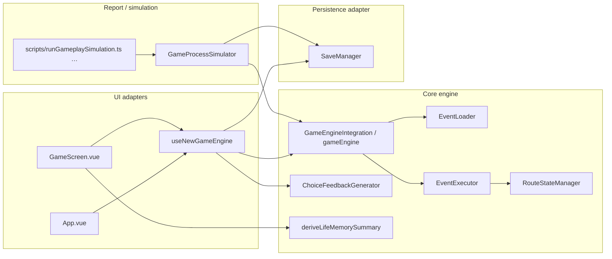

# P4 Engine Boundary Baseline (US-001)

## Scope and method

- **Story:** P4 US-001 — Rebaseline Current Engine Boundaries
- **Scope:** Read-only inventory of current engine, UI, persistence, and simulation boundaries. No business code changes. No new contract design.
- **Sources inspected:** `src/types/eventTypes.ts`, `src/types/lifeMemory.ts`, `src/core/*`, `src/composables/*`, `src/store/gameStore.ts`, `src/components/*`, `src/App.vue`, `tests/GameProcessSimulator.ts`, `tests/GameTestFramework.ts`, `scripts/runGameplaySimulation.ts`, `scripts/life-simulator/simulator.ts`, `scripts/runGoldenLineSimulation.ts`, `scripts/runP3EvalSimulationReport.ts`, and related prior inventories (`us-011-state-source-audit.md`, `us-017-save-state-shape-inventory.md`, `us-002-choice-feedback-source-inventory.md`).
- **Classification legend:**
  - **core engine** — authoritative gameplay state, selection, execution, or pure derived logic
  - **UI adapter** — Vue/components/composables that orchestrate or present engine output
  - **persistence adapter** — save/load serialization and storage
  - **report/simulation** — headless runners, gates, test harnesses, telemetry
  - **deprecated** — legacy or demo-only paths not on the main App flow

## Architecture snapshot

**Main flow today:** `App.vue` → `useNewGameEngine` → `gameEngine` singleton → bundled `EventLoader` catalog + `EventExecutor` effects. Volatile session fields (current event, pending choices, last feedback) live in the composable, not in `GameState`.

---

## Inventory: all entry points

| Domain | Entry point | Location | Classification | Primary consumers | Notes |
| --- | --- | --- | --- | --- | --- |
| **GameState — type contract** | `GameState` interface | `src/types/eventTypes.ts` | core engine | Engine, save, UI, simulation | Canonical runtime shape; includes `player`, `flags`, `relations`, `eventHistory`, `routeStates`, `routeHistory`, `lifePath`, `karma`, `criticalChoices`, save metadata |
| | `PlayerState`, `EventRecord`, related types | `src/types/eventTypes.ts` | core engine | All layers | Nested under `GameState` |
| | Type re-exports | `src/types/index.ts` | core engine | UI, tests | Convenience barrel |
| **GameState — runtime** | `gameEngine` singleton | `src/core/GameEngineIntegration.ts` | core engine | App, composable, components, simulator | Global mutable singleton; state held in Vue `reactive()` |
| | `getGameState()` | `src/core/GameEngineIntegration.ts` | core engine | UI, save, debug, simulation | Returns live reactive reference |
| | `getReactiveGameState()` | `src/core/GameEngineIntegration.ts` | core engine | UI (explicit reactive access) | Same underlying object |
| | `loadGameState(savedState)` | `src/core/GameEngineIntegration.ts` | core engine | `useNewGameEngine.loadGameFromSave` | Hydrates engine; resets yearly counters |
| | `startNewGame(name, gender)` | `src/core/GameEngineIntegration.ts` | core engine | Composable, simulator | Applies trait profile |
| | `reset()` / `resetGame()` | `src/core/GameEngineIntegration.ts` | core engine | Simulator, tests | Duplicate reset paths |
| | `setPlayerAttributes(partial)` | `src/core/GameEngineIntegration.ts` | core engine | Debug / tooling | Direct mutation helper |
| | Identity helpers (`addIdentity`, `removeIdentity`, …) | `src/core/GameEngineIntegration.ts` | core engine | Events, debug | Mutate `GameState.identity` |
| | `advanceTime(value, unit)` | `src/core/GameEngineIntegration.ts` | core engine | Composable, simulator | Time progression |
| | `setSuppressLethalSetbacks(bool)` | `src/core/GameEngineIntegration.ts` | core engine | P3 eval simulation | Test/eval hook only |
| | Volatile UI session state (`currentEvent`, `availableChoices`, `lastEffects`, `lastOutcomeText`, `lastChoiceFeedback`, `isAutoPlaying`) | `src/composables/useNewGameEngine.ts` | UI adapter | `GameScreen`, `App`, `DebugPanel` | **Not** part of `GameState`; lost on reload unless recomputed |
| | `engineState` reactive singleton | `src/composables/useNewGameEngine.ts` | UI adapter | UI components | Module-level singleton composable state |
| **Save manager** | `SaveManager` class + `saveManager` singleton | `src/core/SaveManager.ts` | persistence adapter | Composable, `SaveManager.vue`, simulator | Browser `localStorage` or in-memory fallback |
| | `saveGame(gameState, name)` | `src/core/SaveManager.ts` | persistence adapter | Composable, UI, simulator | Writes full `GameState` to `SaveData.gameData` |
| | `loadGame(saveId)` | `src/core/SaveManager.ts` | persistence adapter | Composable, UI | Version gate via `evaluateSaveCompatibility` |
| | `autoSave` / `loadAutoSave` / `clearAutoSave` | `src/core/SaveManager.ts` | persistence adapter | UI | Separate storage key |
| | `getAllSaves` / `deleteSave` / `clearAllSaves` | `src/core/SaveManager.ts` | persistence adapter | UI | List management |
| | `exportSave` / `importSave` | `src/core/SaveManager.ts` | persistence adapter | UI | JSON string portability |
| | `evaluateSaveCompatibility(saveVersion?)` | `src/core/SaveManager.ts` | persistence adapter | Load path | P2 semver window |
| | `applyP2SaveVersionMarker(gameState)` | `src/core/SaveManager.ts` | persistence adapter | Save write | Stamps `saveVersion`, timestamps |
| | `P2_SAVE_SCHEMA_VERSION` constants | `src/core/SaveManager.ts` | persistence adapter | Save/load | Policy constants |
| | `saveCurrentGame` / `loadGameFromSave` / `getAllSaves` | `src/composables/useNewGameEngine.ts` | UI adapter | `App`, `GameScreen` | Orchestrates save manager + engine hydrate + `getNextEvent` |
| | `SaveManager.vue` UI | `src/components/SaveManager.vue` | UI adapter | `MainDemo`, manual save in `GameScreen` | Emits `gameLoaded`; some demo paths still stubbed |
| **Event loader** | `EventLoader` + `eventLoader` singleton | `src/core/EventLoader.ts` | core engine | `GameEngineIntegration`, composable, tests | Eager-loads bundled JSON at module init |
| | `getEventsByAge(age)` | `src/core/EventLoader.ts` | core engine | Event selection | Primary selection pool input |
| | `getEventById(id)` | `src/core/EventLoader.ts` | core engine | Engine, executor | Lookup |
| | `getAllEvents()` | `src/core/EventLoader.ts` | core engine | Immediate-feedback scan | Full catalog scan |
| | `getEventsByCategory` / `getEventsByPriority` / `getEventsInAgeRange` | `src/core/EventLoader.ts` | core engine | Tooling, validation | Secondary queries |
| | `getWeightForAge(event, age)` | `src/core/EventLoader.ts` | core engine | Weighting | Age-band weights |
| | `validateEvents()` / `printStatistics()` | `src/core/EventLoader.ts` | core engine | Dev tooling | Validation only |
| | `getUndeclaredImportPaths()` | `src/core/EventLoader.ts` | core engine | CI inventory scripts | Catalog integrity |
| | Bundled catalog JSON (`src/data/events.json`, `src/data/lines/*.json`) | `src/data/` | core engine | `EventLoader` static imports | Build-time bundle, not a service API |
| | `EventPreloader` + `eventPreloader` | `src/core/EventPreloader.ts` | UI adapter | `MainDemo.vue` only | Client-side prefetch cache; not on main App path |
| **Choice execution** | `selectEvent(age?)` | `src/core/GameEngineIntegration.ts` | core engine | Composable, simulator | Weighted selection + guards |
| | `getAvailableEvents(age)` | `src/core/GameEngineIntegration.ts` | core engine | Debug, tests | Filtered candidate pool |
| | `executeChoiceEffects(effects, eventId?, choiceId?)` | `src/core/GameEngineIntegration.ts` | core engine | Composable, simulator | Primary choice mutation entry |
| | `executeAutoEvent(event)` | `src/core/GameEngineIntegration.ts` | core engine | Composable, simulator | Auto/ending events |
| | `isChoiceAvailable(condition)` | `src/core/GameEngineIntegration.ts` | core engine | Composable, simulator | Choice gating |
| | `consumeLastEventOutcomeNote()` | `src/core/GameEngineIntegration.ts` | core engine | Simulator | Ephemeral narrative note |
| | `EventExecutor.executeEffects(effects, state)` | `src/core/EventExecutor.ts` | core engine | Engine integration | Effect handler registry |
| | Effect handler classes (`StatModifyHandler`, `FlagSetHandler`, …) | `src/core/EventExecutor.ts` | core engine | Via executor | Includes route sync on flags |
| | `resolveChoiceEffects` / `resolveFirstChoiceEffects` | `src/core/ChoiceOutcomeResolver.ts` | core engine | `GameProcessSimulator` | Headless outcome pick helper |
| | `getNextEvent()` | `src/composables/useNewGameEngine.ts` | UI adapter | App flow | Pulls event, branches auto vs choice |
| | `handleChoice(choice, context?)` | `src/composables/useNewGameEngine.ts` | UI adapter | `GameScreen`, auto-resolve | Outcome branch eval, calls engine, writes feedback |
| | `processAutoEvent(event)` | `src/composables/useNewGameEngine.ts` | UI adapter | Internal composable | Wraps `executeAutoEvent` + UI timing |
| | Outcome condition eval (`evaluateOutcomeCondition`) | `src/composables/useNewGameEngine.ts` | UI adapter | `handleChoice` | Duplicated concern vs `ChoiceOutcomeResolver` |
| **Feedback** | `generateChoiceFeedback(input)` | `src/core/ChoiceFeedbackGenerator.ts` | core engine | `useNewGameEngine.handleChoice` | Pure derived `ChoiceFeedbackModel`; no state mutation |
| | `ChoiceFeedbackModel` types | `src/types/` | core engine | UI rendering | Structured player-facing feedback |
| | `engineState.lastOutcomeText` | `src/composables/useNewGameEngine.ts` | UI adapter | `GameScreen` | Volatile narrative string |
| | `engineState.lastChoiceFeedback` | `src/composables/useNewGameEngine.ts` | UI adapter | `GameScreen` | Volatile structured feedback |
| | `generateOutcomeText(effects)` | `src/composables/useNewGameEngine.ts` | UI adapter | Fallback narrative | Composable-local helper |
| **Route state** | `RouteStateManager` static API (`readRouteState`, `writeRouteState`, `lockRoute`, `completeRoute`, `failRoute`, `turnRoute`, `deactivateRoute`, `syncFromFlagSet`, `syncFromFlagUnset`, `resolveStrongExclusionsBeforeActivate`) | `src/core/RouteStateManager.ts` | core engine | `EventExecutor`, tests | Writes `GameState.routeStates` + `routeHistory` |
| | `RouteCompatibilityRules` / `resolveRouteConflict` | `src/core/RouteCompatibilityRules.ts` | core engine | Route activation | Exclusion table |
| | `GameState.routeStates` / `routeHistory` fields | `src/types/eventTypes.ts` | core engine | Save, simulation, life memory | Persisted route lifecycle |
| | Flag-based route display (`routeLabel`, player-facing labels) | `src/components/GameScreen.vue`, `src/utils/playerFacingLabels.ts` | UI adapter | Main UI | Display derives from flags + derived summary |
| **Life memory** | `deriveLifeMemorySummary(state)` | `src/core/deriveLifeMemorySummary.ts` | core engine | `GameScreen` | Pure derived aggregate from `GameState` |
| | `serializeLifeMemorySummary(summary)` | `src/core/deriveLifeMemorySummary.ts` | core engine | Future transport | JSON-safe copy |
| | `LIFE_MEMORY_SCHEMA_VERSION` + types | `src/types/lifeMemory.ts` | core engine | P3 contract | Explicitly documented as derived-only, not redundant persisted state |
| | Life memory panel rendering | `src/components/GameScreen.vue` | UI adapter | Player UI | Calls derive on read |
| **Supporting engine modules** | `ConditionEvaluator` | `src/core/ConditionEvaluator.ts` | core engine | Selection, choices, executor | Shared guard evaluation |
| | `appendFormalEventHistory` | `src/core/EventHistory.ts` | core engine | Engine integration | Formal trigger log |
| | `LifePathManager` | `src/core/LifePathSystem.ts` | core engine | Selection, executor | Life stage + path gates |
| | `CriticalChoiceSystem` | `src/core/CriticalChoiceSystem.ts` | core engine | Engine integration | Key choice recording |
| | `IdentitySystem`, `KarmaManager`, `EndingSystem`, `TraitSystem`, `TalentSystem`, `StatGrowthSystem`, `DailyEventSystem`, `SetbackEventSystem`, `ChallengeSystem`, `ReputationGateSystem`, `DifficultyManager`, `difficultyMonitor` | `src/core/*.ts` | core engine | Engine subsystems | `DifficultyManager` / `difficultyMonitor` additionally use Vue `reactive` and browser storage |
| **Simulation / report** | `GameProcessSimulator` class | `tests/GameProcessSimulator.ts` | report/simulation | Scripts, gates | Full-life runner; optional save/restore checks |
| | `GameTestFramework` | `tests/GameTestFramework.ts` | report/simulation | Unit/integration tests | Isolated executor/evaluator tests |
| | `tests/IntegrationTest.ts` | `tests/IntegrationTest.ts` | report/simulation | CI | Direct `gameEngine` smoke |
| | `npm run simulate:gameplay` → `scripts/runGameplaySimulation.ts` | `scripts/runGameplaySimulation.ts` | report/simulation | Local/CI | Batch samples + optional gate |
| | `scripts/life-simulator/simulator.ts` | `scripts/life-simulator/simulator.ts` | report/simulation | Legacy CLI alias | Forwards to `GameProcessSimulator` |
| | `npm run simulate:golden-line` → `scripts/runGoldenLineSimulation.ts` | `scripts/runGoldenLineSimulation.ts` | report/simulation | P3 golden line | Segment reports |
| | `npm run simulate:p3-eval` → `scripts/runP3EvalSimulationReport.ts` | `scripts/runP3EvalSimulationReport.ts` | report/simulation | P3 eval cohort | Deterministic samples |
| | Gate scripts (`gate:golden-line`, `gate:midlife`, `gate:experience`, …) | `scripts/*Gate*.ts` | report/simulation | CI governance | Consume simulation output |
| | Death/rhythm telemetry helpers | `scripts/deathRiskTelemetry.ts`, `scripts/reportRhythmMetrics.ts`, … | report/simulation | Reports | Read simulation artifacts |
| **UI shell (non-engine)** | `App.vue` | `src/App.vue` | UI adapter | Entry | Phase routing start/play/ending |
| | `GameScreen.vue` | `src/components/GameScreen.vue` | UI adapter | Main play surface | Choice UI + life memory |
| | `StartScreen.vue` / `EndingScreen.vue` | `src/components/` | UI adapter | Flow chrome | No engine logic |
| | `DebugPanel.vue` | `src/components/DebugPanel.vue` | UI adapter | Debug | Reads engine + composable; console hijack |
| | `MainDemo.vue` | `src/components/MainDemo.vue` | UI adapter | Demo page | Not wired to App entry |
| | `DemoPage.vue` | `src/components/DemoPage.vue` | UI adapter | Demo page | Experimental |

---

## Deprecated entries

| Entry point | Location | Was used for | Replacement / status |
| --- | --- | --- | --- |
| `useGameStore()` | `src/store/gameStore.ts` | Legacy reactive player store | **`gameEngine.getGameState()`** via `useNewGameEngine` |
| `useGameEngine()` | `src/composables/useGameEngine.ts` | Old story-node loop over `storyData` | **`useNewGameEngine` + `GameEngineIntegration`** |
| `EffectExecutor` / `effectExecutor` | `src/core/EffectExecutor.ts` | Legacy `StoryNode` effect execution (`TIME_ADVANCE`, `STAT_MODIFY`, …) | **`EventExecutor`** in new event system |
| `storyData` / `getAvailableNodes` | `src/data/storyData.ts` | Pre–event-system narrative graph | **Bundled JSON event catalog** via `EventLoader` |
| `MainDemo.loadGameFromSave(gameState)` stub | `src/components/MainDemo.vue` | Demo save reload | **`useNewGameEngine.loadGameFromSave(saveId)`** on main flow; demo stub still no-op |
| `SaveManager.vue` → `MainDemo` `gameLoaded` emit path | `src/components/SaveManager.vue` + `MainDemo.vue` | Emit raw `gameData` without engine hydrate | Main **`GameScreen` / `App`** use composable load by save id |
| Duplicate reset APIs (`reset` vs `resetGame`) | `src/core/GameEngineIntegration.ts` | Engine reset | Both active; callers differ (`reset` in simulator, `resetGame` rarely used) |

---

## Backend-blocking runtime dependencies

These are **current** couplings that would impede running the engine as a headless backend service without an adapter/refactor layer. Ordered by severity.

| # | Dependency | Where | Why it blocks backend execution |
| --- | --- | --- | --- |
| 1 | **Vue `reactive()` owns canonical `GameState`** | `GameEngineIntegration` constructor + `applyGameState` | Engine core imports `vue` and wraps state in reactive proxies. A Node/API runtime would still pull Vue reactivity into the hot path and complicate plain-object serialization boundaries. |
| 2 | **Global singletons (`gameEngine`, `eventLoader`, `saveManager`)** | `GameEngineIntegration.ts`, `EventLoader.ts`, `SaveManager.ts` | No session-scoped engine instance; concurrent users/saves would share mutable state unless externalized. |
| 3 | **Volatile session state outside `GameState`** | `useNewGameEngine.engineState` | Current event, pending choices, and last feedback are not in the persisted snapshot. A backend “continue turn” API cannot reconstruct pending choice UI from snapshot alone. |
| 4 | **Event catalog bundled via static ESM imports** | `EventLoader.ts` + `src/data/lines/*.json` | Catalog is compile-time bundled, not injected or version-fetched. Backend would duplicate catalog delivery or share the same bundle artifact. |
| 5 | **`Math.random()` without engine-level seed context** | `GameEngineIntegration`, `EventExecutor`, `TraitSystem`, `DailyEventSystem`, `ChallengeSystem`, `SetbackEventSystem`, … | Deterministic replay requires process-wide patching (as `GameProcessSimulator.withSeededRandom` does). No first-class RNG port on the engine. |
| 6 | **Browser storage in persistence and difficulty config** | `SaveManager` (`window.localStorage`), `DifficultyManager` (`localStorage` for config) | Persistence adapter assumes browser storage keys (`wuxia_life_saves`, etc.). Node simulation uses in-memory fallback only inside `SaveManager`, not a pluggable backend store. |
| 7 | **Browser-only UI timing in choice flow** | `useNewGameEngine.handleChoice` uses `requestAnimationFrame` | Breaks in non-DOM environments unless stubbed. |
| 8 | **Vue `reactive` difficulty subsystems** | `DifficultyManager.ts`, `DifficultyMonitor.ts` | Secondary engine-adjacent state also Vue-coupled. |
| 9 | **Split choice orchestration (UI vs headless)** | Composable outcome eval vs `ChoiceOutcomeResolver` | Two paths pick outcomes; backend would need one authoritative orchestrator to avoid drift. |
| 10 | **Direct component reads of singleton engine** | `GameScreen.vue`, `DebugPanel.vue`, `SaveManager.vue` | UI reaches into global engine instead of a transport boundary; mirrors why a future API layer must sit above core calls. |
| 11 | **Implicit side effects via console / alert** | `App.vue` (`window.alert` on load failure), verbose `console.warn` in save/load | Not blocking logic but unsuitable for service responses without adapter translation. |
| 12 | **Life memory derived at UI read time** | `GameScreen.vue` calls `deriveLifeMemorySummary` | Acceptable for client-only; backend would need explicit “derive on read” or “derive on write” contract (P4 US-003+ scope). |

### Non-blocking but noteworthy

- **`loadGameState` exists** on the engine and is used by the main composable — prior demo-gap notes about missing hydrate are **partially closed** on App/GameScreen path, but **MainDemo stub remains**.
- **Save schema versioning** is enforced on read (`evaluateSaveCompatibility`) but full field migration is out of P2 scope.
- **Simulations already run in Node** by importing the same singleton engine, proving headless execution is *possible today* only because Vue/reactive and patched `Math.random` tolerate the environment — not because boundaries are clean.

---

## Domain summaries

### GameState

- **Authoritative persisted shape:** `GameState` in `src/types/eventTypes.ts`.
- **Authoritative runtime holder:** `GameEngineIntegration.gameState` (Vue reactive).
- **Not persisted today:** composable `engineState` session fields (current event, choices, feedback).
- **Hydration entry:** `gameEngine.loadGameState(savedState)`; composable clears session fields then calls `getNextEvent()`.

### Save manager

- **Write path:** `saveManager.saveGame(gameEngine.getGameState(), name)` stamps P2 version metadata and stores entire `GameState`.
- **Read path:** `saveManager.loadGame(id)` → composable → `loadGameState` → re-select next event.
- **Storage:** browser `localStorage` keys `wuxia_life_saves`, `wuxia_life_auto_save`; in-memory map when non-browser.

### Event loader

- Single eager singleton loads all line JSON modules declared in `src/data/events.json`.
- Selection consumes `getEventsByAge`; engine applies additional runtime guards (conditions, life path, reputation, route weighting, cooldowns).

### Choice execution

- **Selection:** `selectEvent` (engine).
- **Mutation:** `executeChoiceEffects` / `executeAutoEvent` (engine) → `EventExecutor`.
- **UI orchestration:** composable resolves outcome branches, generates feedback, manages pacing.
- **Simulation:** `GameProcessSimulator` calls engine methods directly; uses `ChoiceOutcomeResolver` for headless picks.

### Feedback

- **Structured:** `generateChoiceFeedback` (pure, core).
- **Displayed:** composable → `GameScreen` (`lastOutcomeText`, `lastChoiceFeedback`).
- **Long-term narrative audit:** `eventHistory`, `criticalChoices`, route history — in `GameState`.

### Route state

- **Structured store:** `GameState.routeStates` + `routeHistory`, maintained by `RouteStateManager` on flag effects and explicit route transitions.
- **Legacy parallel signals:** player/route flags still influence selection weights and UI labels.

### Life memory

- **Derived-only contract:** `deriveLifeMemorySummary(state)` → `LifeMemorySummary` (`LIFE_MEMORY_SCHEMA_VERSION = 1.0.0`).
- **Inputs:** route states, event history, relationships, flags, critical choices, golden-line maps — all read from `GameState`.
- **Not written back** into save payload as a separate persisted blob.

### Simulation entry points

| Command / entry | Delegates to |
| --- | --- |
| `npm run simulate:gameplay` | `scripts/runGameplaySimulation.ts` → `GameProcessSimulator` |
| `npm run simulate:gameplay:samples` | Same with `--samples` |
| `npm run simulate:golden-line` | `scripts/runGoldenLineSimulation.ts` |
| `npm run simulate:p3-eval` | `scripts/runP3EvalSimulationReport.ts` |
| `tsx scripts/life-simulator/simulator.ts` | Thin wrapper → `GameProcessSimulator` |
| `tests/GameProcessSimulator.ts` | Primary headless full-life harness |
| `tests/GameTestFramework.ts` | Lower-level executor/evaluator tests |

---

## Gaps surfaced for downstream P4 stories (informational only)

- No versioned **`GameStateSnapshot`** transport type separate from runtime `GameState` (US-003/US-004).
- No **`ChoiceExecution` request/response** contract; split across composable + engine methods (US-007/US-008).
- No replay log contract; simulator records ad hoc in `GameProcessReport.records` (US-009+).
- Event catalog service boundary undefined; catalog is build-time bundle (US-011+).
- Volatile UI session fields need explicit classification in a future snapshot contract.

---

## Validation

- Business code: **unchanged** (documentation only).
- Typecheck: `npm run typecheck` — **passed** (`tsc --noEmit`, exit 0).
